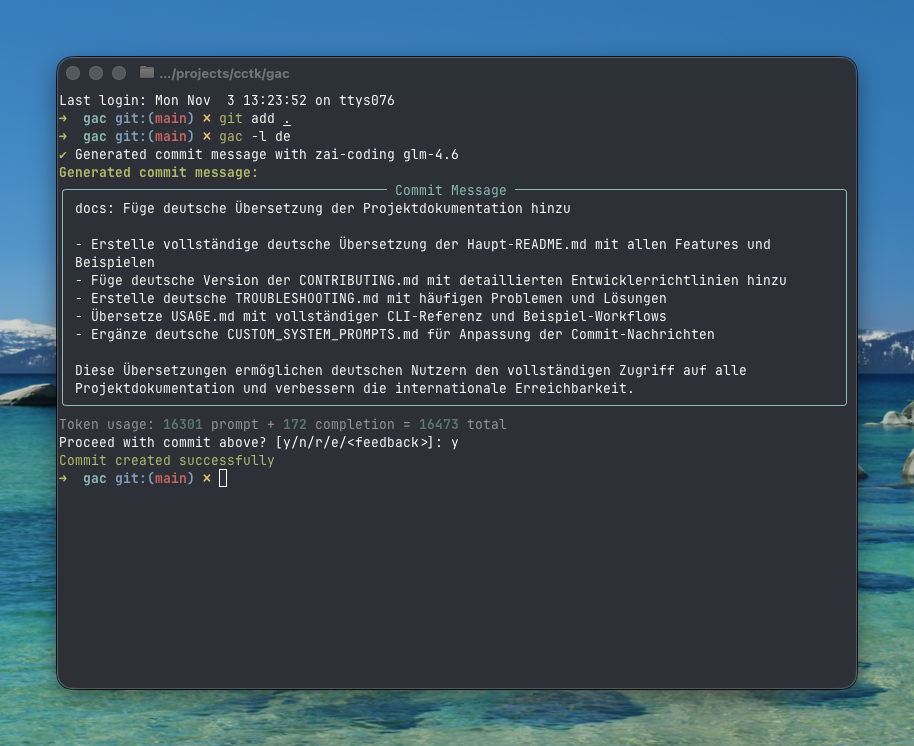

<!-- markdownlint-disable MD013 -->
<!-- markdownlint-disable MD033 MD036 -->

<div align="center">

# 🚀 Git Auto Commit (gac)

[](https://pypi.org/project/gac/)
[](https://www.python.org/downloads/)
[](https://github.com/cellwebb/gac/actions)
[](https://app.codecov.io/gh/cellwebb/gac)
[](https://github.com/astral-sh/ruff)
[](https://mypy-lang.org/)
[](docs/de/CONTRIBUTING.md)
[](LICENSE)

[English](README.md) | [简体中文](README.zh-CN.md) | [繁體中文](README.zh-TW.md) | [日本語](README.ja.md) | [한국어](README.ko.md) | [हिन्दी](README.hi.md) | [Français](README.fr.md) | [Русский](README.ru.md) | [Español](README.es.md) | [Português](README.pt.md) | **Deutsch** | [Nederlands](README.nl.md)

**LLM-gestützte Commit-Nachrichten, die Ihren Code verstehen!**

**Automatisieren Sie Ihre Commits!** Ersetzen Sie `git commit -m "..."` durch `gac` für kontextbezogene, gut formatierte Commit-Nachrichten, die von großen Sprachmodellen generiert werden!

---

## Was Sie erhalten

Intelligente, kontextbezogene Nachrichten, die das **Warum** hinter Ihren Änderungen erklären:



---

</div>

<!-- markdownlint-enable MD033 MD036 -->

<!-- markdownlint-enable MD033 MD036 -->

## Schnellstart

### gac ohne Installation verwenden

```bash
uvx gac init   # Konfigurieren Sie Ihren Provider, Ihr Modell und Ihre Sprache
uvx gac model  # Provider/Modell-Setup erneut ausführen ohne Spracheingabeaufforderungen
uvx gac  # Generieren und committen mit LLM
```

Das ist alles! Überprüfen Sie die generierte Nachricht und bestätigen Sie mit `y`.

### gac installieren und verwenden

```bash
uv tool install gac
gac init
gac model
gac
```

### Installiertes gac aktualisieren

```bash
uv tool upgrade gac
```

---

## Hauptfunktionen

### 🌐 **Unterstützte Provider**

- **Anthropic** • **Cerebras** • **Chutes.ai** • **DeepSeek** • **Fireworks**
- **Gemini** • **Groq** • **LM Studio** • **MiniMax** • **Mistral** • **Ollama** • **OpenAI**
- **OpenRouter** • **Streamlake** • **Synthetic.new** • **Together AI**
- **Z.AI** • **Z.AI Coding** • **Benutzerdefinierte Endpunkte (Anthropic/OpenAI)**

### 🧠 **Intelligente LLM-Analyse**

- **Versteht die Absicht**: Analysiert Code-Struktur, Logik und Muster, um das "Warum" hinter Ihren Änderungen zu verstehen, nicht nur was sich geändert hat
- **Semantisches Bewusstsein**: Erkennt Refactoring, Bug-Fixes, Features und Breaking Changes, um kontextbezogene Nachrichten zu generieren
- **Intelligentes Filtern**: Priorisiert sinnvolle Änderungen und ignoriert generierte Dateien, Abhängigkeiten und Artefakte
- **Intelligentes Commit-Grouping** - Gruppiert automatisch zusammengehörige Änderungen in mehreren logischen Commits mit `--group`

### 📝 **Mehrere Nachrichtenformate**

- **Einzeiler** (-o Flag): Einzeilige Commit-Nachricht im conventional commit Format
- **Standard** (Standard): Zusammenfassung mit Stichpunkten zur Erklärung der Implementierungsdetails
- **Ausführlich** (-v Flag): Umfassende Erklärungen inklusive Motivation, technischer Herangehensweise und Impact-Analyse

### 🌍 **Mehrsprachige Unterstützung**

- **25+ Sprachen**: Generieren Sie Commit-Nachrichten in Englisch, Chinesisch, Japanisch, Koreanisch, Spanisch, Französisch, Deutsch und 20+ weiteren Sprachen
- **Flexible Übersetzung**: Wählen Sie, ob Sie conventional commit Präfixe auf Englisch für Tool-Kompatibilität belassen oder vollständig übersetzen möchten
- **Mehrere Workflows**: Stellen Sie eine Standardsprache mit `gac language` ein oder verwenden Sie das `-l <Sprache>`-Flag für einmalige Überschreibungen
- **Unterstützung für native Skripte**: Volle Unterstützung für nicht-lateinische Skripte inklusive CJK, Kyrillisch, Arabisch und mehr

### 💻 **Developer Experience**

- **Interaktives Feedback**: Geben Sie `r` ein zum erneuten Generieren, `e` zum direkten Bearbeiten mit vi/emacs Tastaturbelegungen oder geben Sie direkt Ihr Feedback ein wie `mache es kürzer` oder `konzentriere dich auf den Bug-Fix`
- **Ein-Befehl-Workflows**: Vollständige Workflows mit Flags wie `gac -ayp` (alles hinzufügen, automatisch bestätigen, pushen)
- **Git-Integration**: Respektiert pre-commit und lefthook Hooks, führt sie vor teuren LLM-Operationen aus

### 🛡️ **Eingebaute Sicherheit**

- **Automatische Geheimsnis-Erkennung**: Scannt vor dem Commit nach API-Schlüsseln, Passwörtern und Tokens
- **Interaktiver Schutz**: Fordert vor dem Commit potenziell sensibler Daten auf mit klaren Korrekturoptionen
- **Intelligentes Filtern**: Ignoriert Beispieldateien, Vorlagendateien und Platzhaltertext zur Reduzierung von Falschpositiven

---

## Verwendungsbeispiele

### Basis-Workflow

```bash
# Ihre Änderungen hinzufügen
git add .

# Generieren und committen mit LLM
gac

# Überprüfen → y (commit) | n (abbrechen) | r (erneut generieren) | e (bearbeiten) | oder Feedback eingeben
```

### Häufige Befehle

| Befehl             | Beschreibung                                                                         |
| ------------------ | ------------------------------------------------------------------------------------ |
| `gac`              | Commit-Nachricht generieren                                                          |
| `gac -y`           | Automatisch bestätigen (keine Überprüfung erforderlich)                              |
| `gac -a`           | Alle Änderungen vor der Generierung der Commit-Nachricht hinzufügen                  |
| `gac -o`           | Einzeilige Nachricht für triviale Änderungen                                         |
| `gac -v`           | Ausführliches Format mit Motivation, technischer Herangehensweise und Impact-Analyse |
| `gac -h "hinweis"` | Kontext für LLM hinzufügen (z.B. `gac -h "bug fix"`)                                 |
| `gac -s`           | Scope einschließen (z.B. feat(auth):)                                                |
| `gac -p`           | Commit und push                                                                      |

### Power-User-Beispiele

```bash
# Vollständiger Workflow in einem Befehl
gac -ayp -h "Release-Vorbereitung"

# Detaillierte Erklärung mit Scope
gac -v -s

# Schneller Einzeiler für kleine Änderungen
gac -o

# Änderungen in logisch zusammengehörige Commits gruppieren
gac -ag

# Debuggen, was das LLM sieht
gac --show-prompt

# Sicherheits-Scan überspringen (vorsichtig verwenden)
gac --skip-secret-scan
```

### Interaktives Feedback-System

Nicht zufrieden mit dem Ergebnis? Sie haben mehrere Optionen:

```bash
# Einfaches erneutes Generieren (kein Feedback)
r

# Direkt bearbeiten mit erweitertem Terminal-Editing
e
# Verwendet prompt_toolkit für mehrzeiliges Editing mit vi/emacs Tastaturbelegungen
# Esc+Enter oder Ctrl+S zum Absenden, Ctrl+C zum Abbrechen

# Oder geben Sie Ihr Feedback direkt ein!
mache es kürzer und konzentriere dich auf die Performance-Verbesserung
verwende conventional commit Format mit Scope
erkläre die Sicherheitsimplikationen

# Enter bei leerer Eingabe drücken, um die Eingabeaufforderung erneut zu sehen
```

Die Bearbeitungsfunktion (`e`) bietet erweitertes direktes Terminal-Editing, das es Ihnen ermöglicht:

- **Natürlich bearbeiten**: Mehrzeiliges Editing mit bekannten vi/emacs Tastaturbelegungen
- **Schnelle Korrekturen**: Tippfehler korrigieren, Wortlaut anpassen oder Formatierung verfeinern
- **Details hinzufügen**: Informationen einfügen, die das LLM möglicherweise übersehen hat
- **Umstrukturieren**: Stichpunkte neu anordnen oder Nachrichtenstruktur ändern

---

## Konfiguration

Führen Sie `gac init` aus, um Ihren Provider interaktiv zu konfigurieren, oder setzen Sie Umgebungsvariablen:

Später Provider oder Modelle ändern, ohne Spracheinstellungen zu berühren? Verwenden Sie `gac model` für einen optimierten Ablauf, der die Spracheingabeaufforderungen überspringt.

```bash
# Beispielkonfiguration
GAC_MODEL=anthropic:your-model-name
OPENAI_API_KEY=your_key_here
ANTHROPIC_API_KEY=your_key_here
```

Siehe `.gac.env.example` für alle verfügbaren Optionen.

**Möchten Sie Commit-Nachrichten in einer anderen Sprache?** Führen Sie `gac language` aus, um aus 25+ Sprachen zu wählen, inklusive Español, Français, 日本語 und mehr.

**Möchten Sie den Stil der Commit-Nachrichten anpassen?** Siehe [docs/CUSTOM_SYSTEM_PROMPTS.md](docs/de/CUSTOM_SYSTEM_PROMPTS.md) für Anleitungen zum Schreiben von benutzerdefinierten System-Prompts.

---

## Projekt-Analytics

📊 **[Live-Nutzungsanalytics und Statistiken ansehen →](https://clickpy.clickhouse.com/dashboard/gac)**

Verfolgen Sie Echtzeit-Installationsmetriken und Paket-Download-Statistiken.

---

## Hilfe erhalten

- **Vollständige Dokumentation**: [docs/USAGE.md](docs/de/USAGE.md) - Vollständige CLI-Referenz
- **Benutzerdefinierte Prompts**: [docs/CUSTOM_SYSTEM_PROMPTS.md](docs/de/CUSTOM_SYSTEM_PROMPTS.md) - Commit-Nachrichten-Stil anpassen
- **Fehlerbehebung**: [docs/TROUBLESHOOTING.md](docs/de/TROUBLESHOOTING.md) - Häufige Probleme und Lösungen
- **Mitwirken**: [docs/CONTRIBUTING.md](docs/de/CONTRIBUTING.md) - Entwicklungseinrichtung und Richtlinien

---

<!-- markdownlint-disable MD033 MD036 -->

<div align="center">

Mit ❤️ gemacht für Entwickler, die bessere Commit-Nachrichten wollen

[⭐ Star uns auf GitHub](https://github.com/cellwebb/gac) • [🐛 Probleme melden](https://github.com/cellwebb/gac/issues) • [📖 Vollständige Doku](docs/de/USAGE.md)

</div>

<!-- markdownlint-enable MD033 MD036 -->
