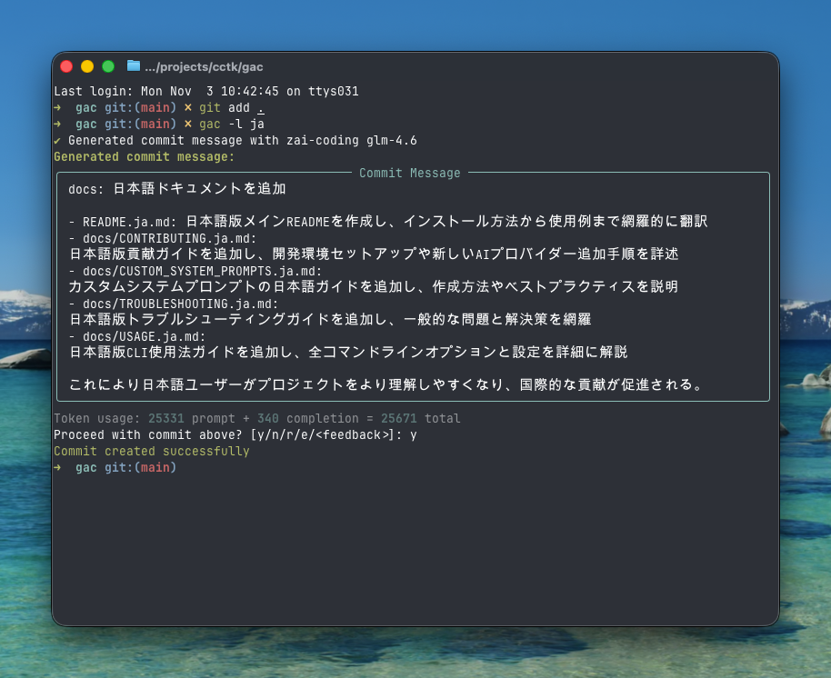

<!-- markdownlint-disable MD013 -->
<!-- markdownlint-disable MD033 MD036 -->

<div align="center">

# 🚀 Git Auto Commit (gac)

[](https://pypi.org/project/gac/)
[](https://www.python.org/downloads/)
[](https://github.com/cellwebb/gac/actions)
[](https://app.codecov.io/gh/cellwebb/gac)
[](https://github.com/astral-sh/ruff)
[](https://mypy-lang.org/)
[](docs/CONTRIBUTING.ja.md)
[](LICENSE)

[English](README.md) | [简体中文](README.zh-CN.md) | [繁體中文](README.zh-TW.md) | **日本語** | [Français](README.fr.md) | [Русский](README.ru.md) | [Español](README.es.md) | [Português](README.pt.md) | [हिन्दी](README.hi.md)

**LLM を活用した、あなたのコードを理解するコミットメッセージ！**

**コミット作業を自動化！** `git commit -m "..."` の代わりに `gac` を使って、大規模言語モデルが生成する文脈に応じた、適切にフォーマットされたコミットメッセージを作成しましょう！

---

## できること

変更の背後にある「なぜ」を説明する、知的で文脈に応じたメッセージが得られます：



---

</div>

<!-- markdownlint-enable MD033 MD036 -->

<!-- markdownlint-enable MD033 MD036 -->

## クイックスタート

### インストールなしで gac を使用する

```bash
uvx gac init   # プロバイダー、モデル、言語を設定
uvx gac model  # 言語プロンプトなしでプロバイダー/モデル設定を再実行
uvx gac  # LLMで生成してコミット
```

これだけです！生成されたメッセージを確認して `y` で確定します。

### gac をインストールして使用する

```bash
uv tool install gac
gac init
gac model
gac
```

### インストール済みの gac をアップグレード

```bash
uv tool upgrade gac
```

---

## 主な機能

### 🌐 **対応プロバイダー**

- **Anthropic** • **Cerebras** • **Chutes.ai** • **DeepSeek** • **Fireworks**
- **Gemini** • **Groq** • **LM Studio** • **MiniMax** • **Mistral** • **Ollama** • **OpenAI**
- **OpenRouter** • **Streamlake** • **Synthetic.new** • **Together AI**
- **Z.AI** • **Z.AI Coding** • **カスタムエンドポイント (Anthropic/OpenAI)**

### 🧠 **スマートな LLM 分析**

- **意図を理解**: コード構造、ロジック、パターンを分析して、変更点だけでなく「なぜ」変更したのかを理解
- **意味論的な認識**: リファクタリング、バグ修正、機能追加、破壊的変更を認識して文脈に応じた適切なメッセージを生成
- **インテリジェントなフィルタリング**: 生成されたファイル、依存関係、アーティファクトを無視しながら意味のある変更を優先
- **インテリジェントなコミットグループ化** - `--group` で関連する変更を複数の論理的なコミットに自動的にグループ化

### 📝 **複数のメッセージ形式**

- **ワンライナー** (-o フラグ): 従来のコミット形式に従う単一行のコミットメッセージ
- **標準** (デフォルト): 実装の詳細を説明する箇条書き付きの要約
- **詳細** (-v フラグ): 動機、技術的アプローチ、影響分析を含む包括的な説明

### 🌍 **多言語サポート**

- **25 以上の言語**: 英語、中国語、日本語、韓国語、スペイン語、フランス語、ドイツ語など 20 以上の言語でコミットメッセージを生成
- **柔軟な翻訳**: ツール互換性のために従来のコミットプレフィックスを英語のままにするか、完全に翻訳するかを選択
- **複数のワークフロー**: `gac language` でデフォルト言語を設定するか、`-l <language>` フラグで一回限り上書き
- **ネイティブスクリプトサポート**: CJK、キリル文字、アラビア文字など非ラテン文字も完全サポート

### 💻 **開発者体験**

- **対話型フィードバック**: `r` で再生成、`e` で vi/emacs キーバインドでその場編集、または「もっと短くして」「バグ修正に集中」のようなフィードバックを直接入力
- **ワンコマンドワークフロー**: `gac -ayp` のようなフラグで完全なワークフロー（すべてステージ、自動確定、プッシュ）
- **Git 統合**: 高価な LLM 操作の前に pre-commit と lefthook フックを実行して尊重

### 🛡️ **組み込みセキュリティ**

- **自動秘密検出**: コミット前に API キー、パスワード、トークンをスキャン
- **対話型保護**: 機密性の高いデータをコミットする前にプロンプトと明確な修復オプションを表示
- **スマートフィルタリング**: 偽陽性を減らすためにサンプルファイル、テンプレートファイル、プレースホルダーテキストを無視

---

## 使用例

### 基本ワークフロー

```bash
# 変更をステージ
git add .

# LLMで生成してコミット
gac

# 確認 → y (コミット) | n (キャンセル) | r (再生成) | e (編集) | またはフィードバックを入力
```

### 一般的なコマンド

| コマンド          | 説明                                                  |
| ----------------- | ----------------------------------------------------- |
| `gac`             | コミットメッセージを生成                              |
| `gac -y`          | 自動確定（確認不要）                                  |
| `gac -a`          | コミットメッセージ生成前にすべての変更をステージ      |
| `gac -o`          | 些細な変更のための単一行メッセージ                    |
| `gac -v`          | 動機、技術的アプローチ、影響分析を含む詳細形式        |
| `gac -h "ヒント"` | LLM へのコンテキストを追加（例: `gac -h "バグ修正"`） |
| `gac -s`          | スコープを含める（例: feat(auth):）                   |
| `gac -p`          | コミットしてプッシュ                                  |

### パワーユーザー例

```bash
# 一コマンドで完全なワークフロー
gac -ayp -h "リリース準備"

# スコープ付きの詳細な説明
gac -v -s

# 小さな変更のためのクイックワンライナー
gac -o

# 変更を論理的に関連するコミットにグループ化
gac -ag

# LLMが見ているものをデバッグ
gac --show-prompt

# セキュリティスキャンをスキップ（注意して使用）
gac --skip-secret-scan
```

### 対話型フィードバックシステム

結果に満足できないですか？いくつかのオプションがあります：

```bash
# シンプルな再生成（フィードバックなし）
r

# リッチなターミナル編集でその場編集
e
# prompt_toolkitを使用した複数行編集（vi/emacsキーバインド対応）
# Esc+EnterまたはCtrl+Sで送信、Ctrl+Cでキャンセル

# またはフィードバックを直接入力！
もっと短くして、パフォーマンス改善に集中
スコープ付きで従来のコミット形式を使用
セキュリティへの影響を説明

# 空入力でEnterを押すとプロンプトを再表示
```

編集機能 (`e`) はリッチなインプレースターミナル編集を提供し、以下が可能です：

- **自然に編集**: お馴染みの vi/emacs キーバインドでの複数行編集
- **クイック修正**: タイプの修正、言い回しの調整、フォーマットの洗練
- **詳細の追加**: LLM が見逃した可能性のある情報を含める
- **再構成**: 箇条書きの再整理やメッセージ構造の変更

---

## 設定

`gac init` を実行して対話的にプロバイダーを設定するか、環境変数を設定：

後からプロバイダーやモデルを変更したいが言語設定は触りたくない場合？`gac model` を使用して言語プロンプトをスキップしたストリームラインなフローを実行します。

```bash
# 設定例
GAC_MODEL=anthropic:your-model-name
OPENAI_API_KEY=your_key_here
ANTHROPIC_API_KEY=your_key_here
```

利用可能なすべてのオプションについては `.gac.env.example` を参照。

**別の言語でコミットメッセージが必要ですか？** `gac language を実行して、Español、Français、日本語など 25 以上の言語から選択してください。

**コミットメッセージスタイルをカスタマイズしたいですか？** カスタムシステムプロンプトの作成ガイドについては [docs/CUSTOM_SYSTEM_PROMPTS.ja.md](docs/CUSTOM_SYSTEM_PROMPTS.ja.md) を参照。

---

## プロジェクト分析

📊 **[ライブ使用分析と統計を表示 →](https://clickpy.clickhouse.com/dashboard/gac)**

リアルタイムのインストールメトリクスとパッケージダウンロード統計を追跡。

---

## ヘルプ

- **完全なドキュメント**: [USAGE.md](USAGE.md) - 完全な CLI リファレンス
- **カスタムプロンプト**: [CUSTOM_SYSTEM_PROMPTS.ja.md](docs/CUSTOM_SYSTEM_PROMPTS.ja.md) - コミットメッセージスタイルのカスタマイズ
- **トラブルシューティング**: [TROUBLESHOOTING.ja.md](docs/TROUBLESHOOTING.ja.md) - 一般的な問題と解決策
- **貢献**: [CONTRIBUTING.ja.md](docs/CONTRIBUTING.ja.md) - 開発設定とガイドライン

---

<!-- markdownlint-disable MD033 MD036 -->

<div align="center">

より良いコミットメッセージを求める開発者のために ❤️ で作成

[⭐ GitHub でスターを付ける](https://github.com/cellwebb/gac) • [🐛 問題を報告](https://github.com/cellwebb/gac/issues) • [📖 完全なドキュメント](USAGE.md)

</div>

<!-- markdownlint-enable MD033 MD036 -->
