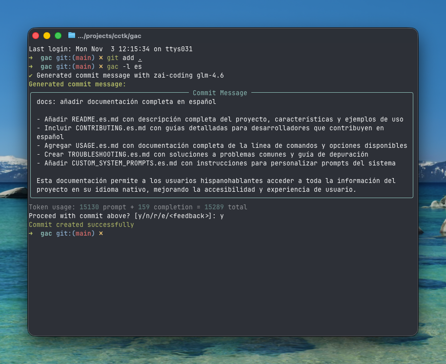

<!-- markdownlint-disable MD013 -->
<!-- markdownlint-disable MD033 MD036 -->

<div align="center">

# 🚀 Git Auto Commit (gac)

[](https://pypi.org/project/gac/)
[](https://www.python.org/downloads/)
[](https://github.com/cellwebb/gac/actions)
[](https://app.codecov.io/gh/cellwebb/gac)
[](https://github.com/astral-sh/ruff)
[](https://mypy-lang.org/)
[](docs/es/CONTRIBUTING.md)
[](LICENSE)

[English](../../README.md) | [简体中文](../zh-CN/README.md) | [繁體中文](../zh-TW/README.md) | [日本語](../ja/README.md) | [한국어](../ko/README.md) | [हिन्दी](../hi/README.md) | [Tiếng Việt](../vi/README.md) | [Français](../fr/README.md) | [Русский](../ru/README.md) | **Español** | [Português](../pt/README.md) | [Norsk](../no/README.md) | [Svenska](../sv/README.md) | [Deutsch](../de/README.md) | [Nederlands](../nl/README.md) | [Italiano](../it/README.md)

**¡Mensajes de commit impulsados por LLM que entienden tu código!**

**¡Automatiza tus commits!** Reemplaza `git commit -m "..."` con `gac` para obtener mensajes de commit contextuales y bien formateados generados por modelos de lenguaje grandes!

---

## Lo que obtienes

Mensajes inteligentes y contextuales que explican el **porqué** detrás de tus cambios:



---

</div>

<!-- markdownlint-enable MD033 MD036 -->

## Inicio rápido

### Usa gac sin instalar

```bash
uvx gac init   # Configura tu proveedor, modelo e idioma
uvx gac  # Genera y hace commit con LLM
```

¡Eso es todo! Revisa el mensaje generado y confirma con `y`.

### Instala y usa gac

```bash
uv tool install gac
gac init
gac
```

### Actualiza gac instalado

```bash
uv tool upgrade gac
```

---

## Características principales

### 🌐 **Proveedores soportados**

- **Anthropic** • **Cerebras** • **Chutes.ai** • **Claude Code**
- **DeepSeek** • **Fireworks** • **Gemini** • **Groq** • **LM Studio**
- **MiniMax** • **Mistral** • **Ollama** • **OpenAI** • **OpenRouter**
- **Streamlake** • **Synthetic.new** • **Together AI**
- **Z.AI** • **Z.AI Coding** • **Endpoints personalizados (Anthropic/OpenAI)**

### 🧠 **Análisis inteligente con LLM**

- **Entiende la intención**: Analiza la estructura del código, lógica y patrones para entender el "porqué" detrás de tus cambios, no solo qué cambió
- **Conciencia semántica**: Reconoce refactorizaciones, correcciones de errores, características y cambios rotos para generar mensajes contextualmente apropiados
- **Filtrado inteligente**: Prioriza cambios significativos mientras ignora archivos generados, dependencias y artefactos
- **Agrupación inteligente de commits** - Agrupa automáticamente cambios relacionados en múltiples commits lógicos con `--group`

### 📝 **Múltiples formatos de mensaje**

- **Una línea** (bandera -o): Mensaje de commit de una sola línea siguiendo el formato de commit convencional
- **Estándar** (predeterminado): Resumen con viñetas explicando detalles de implementación
- **Detallado** (bandera -v): Explicaciones completas incluyendo motivación, enfoque técnico y análisis de impacto

### 🌍 **Soporte multilingüe**

- **25+ idiomas**: Genera mensajes de commit en inglés, chino, japonés, coreano, español, francés, alemán y 20+ idiomas más
- **Traducción flexible**: Elige mantener prefijos de commit convencionales en inglés para compatibilidad de herramientas, o traducirlos completamente
- **Múltiples flujos de trabajo**: Establece un idioma predeterminado con `gac language`, o usa la bandera `-l <idioma>` para anulaciones de una sola vez
- **Soporte de escritura nativa**: Soporte completo para scripts no latinos incluyendo CJK, cirílico, árabe y más

### 💻 **Experiencia del desarrollador**

- **Retroalimentación interactiva**: Escribe `r` para volver a generar, `e` para editar en el lugar con atajos de teclado vi/emacs, o escribe directamente tu retroalimentación como "hazlo más corto" o "enfócate en la corrección del error"
- **Flujos de trabajo de un comando**: Flujos de trabajo completos con banderas como `gac -ayp` (stage todo, auto-confirmar, push)
- **Integración con Git**: Respeta los hooks de pre-commit y lefthook, ejecutándolos antes de operaciones costosas de LLM

### 🛡️ **Seguridad incorporada**

- **Detección automática de secretos**: Escanea claves de API, contraseñas y tokens antes de hacer commit
- **Protección interactiva**: Pregunta antes de hacer commit de datos potencialmente sensibles con claras opciones de remedición
- **Filtrado inteligente**: Ignora archivos de ejemplo, archivos de plantilla y texto de marcador de posición para reducir falsos positivos

---

## Ejemplos de uso

### Flujo de trabajo básico

```bash
# Haz stage de tus cambios
git add .

# Genera y haz commit con LLM
gac

# Revisa → y (commit) | n (cancelar) | r (volver a generar) | e (editar) | o escribe retroalimentación
```

### Comandos comunes

| Comando         | Descripción                                                             |
| --------------- | ----------------------------------------------------------------------- |
| `gac`           | Generar mensaje de commit                                               |
| `gac -y`        | Auto-confirmar (no necesita revisión)                                   |
| `gac -a`        | Hacer stage de todo antes de generar mensaje de commit                  |
| `gac -o`        | Mensaje de una línea para cambios triviales                             |
| `gac -v`        | Formato detallado con Motivación, Enfoque Técnico y Análisis de Impacto |
| `gac -h "hint"` | Añadir contexto para LLM (ej., `gac -h "corrección de error"`)          |
| `gac -s`        | Incluir alcance (ej., feat(auth):)                                      |
| `gac -p`        | Hacer commit y push                                                     |

### Ejemplos para usuarios avanzados

```bash
# Flujo de trabajo completo en un comando
gac -ayp -h "preparación de release"

# Explicación detallada con alcance
gac -v -s

# Mensaje rápido de una línea para cambios pequeños
gac -o

# Agrupar cambios en commits lógicamente relacionados
gac -ag

# Depurar lo que el LLM ve
gac --show-prompt

# Omitir escaneo de seguridad (usar con cuidado)
gac --skip-secret-scan
```

### Sistema de retroalimentación interactiva

¿No estás contento con el resultado? Tienes varias opciones:

```bash
# Volver a generar simple (sin retroalimentación)
r

# Editar en el lugar con edición de terminal rica
e
# Usa prompt_toolkit para edición multilínea con atajos de teclado vi/emacs
# Presiona Esc+Enter o Ctrl+S para enviar, Ctrl+C para cancelar

# ¡O simplemente escribe tu retroalimentación directamente!
hazlo más corto y enfócate en la mejora de rendimiento
usa formato de commit convencional con alcance
explica las implicaciones de seguridad

# Presiona Enter en entrada vacía para ver el prompt nuevamente
```

La función de edición (`e`) proporciona edición de terminal rica en el lugar, permitiéndote:

- **Editar naturalmente**: Edición multilínea con atajos de teclado vi/emacs familiares
- **Hacer correcciones rápidas**: Corregir errores tipográficos, ajustar el wording o refinar el formato
- **Añadir detalles**: Incluir información que el LLM podría haber pasado por alto
- **Reestructurar**: Reorganizar viñetas o cambiar la estructura del mensaje

---

## Configuración

Ejecuta `gac init` para configurar tu proveedor interactivamente, o establece variables de entorno:

¿Necesitas cambiar proveedores o modelos más tarde sin tocar la configuración de idioma? Usa `gac model` para un flujo optimizado que omite los prompts de idioma.

```bash
# Ejemplo de configuración
GAC_MODEL=anthropic:your-model-name
OPENAI_API_KEY=your_key_here
ANTHROPIC_API_KEY=your_key_here
```

Consulta `.gac.env.example` para todas las opciones disponibles.

**¿Quieres mensajes de commit en otro idioma?** Ejecuta `gac language` para seleccionar entre 25+ idiomas incluyendo Español, Français, 日本語 y más.

**¿Quieres personalizar el estilo del mensaje de commit?** Consulta [docs/CUSTOM_SYSTEM_PROMPTS.md](docs/es/CUSTOM_SYSTEM_PROMPTS.md) para orientación sobre cómo escribir prompts de sistema personalizados.

---

## Análisis del proyecto

📊 **[Ver análisis de uso y estadísticas en vivo →](https://clickpy.clickhouse.com/dashboard/gac)**

Rastrea métricas de instalación en tiempo real y estadísticas de descarga de paquetes.

---

## Obtener ayuda

- **Documentación completa**: [USAGE.md](docs/es/USAGE.md) - Referencia completa de CLI
- **Prompts personalizados**: [CUSTOM_SYSTEM_PROMPTS.md](docs/es/CUSTOM_SYSTEM_PROMPTS.md) - Personaliza el estilo del mensaje de commit
- **Solución de problemas**: [TROUBLESHOOTING.md](docs/es/TROUBLESHOOTING.md) - Problemas comunes y soluciones
- **Contribuir**: [CONTRIBUTING.md](docs/es/CONTRIBUTING.md) - Configuración de desarrollo y guías

---

<!-- markdownlint-disable MD033 MD036 -->

<div align="center">

Hecho con ❤️ para desarrolladores que quieren mejores mensajes de commit

[⭐ Danos una estrella en GitHub](https://github.com/cellwebb/gac) • [🐛 Reportar problemas](https://github.com/cellwebb/gac/issues) • [📖 Documentación completa](docs/es/USAGE.md)

</div>

<!-- markdownlint-enable MD033 MD036 -->
