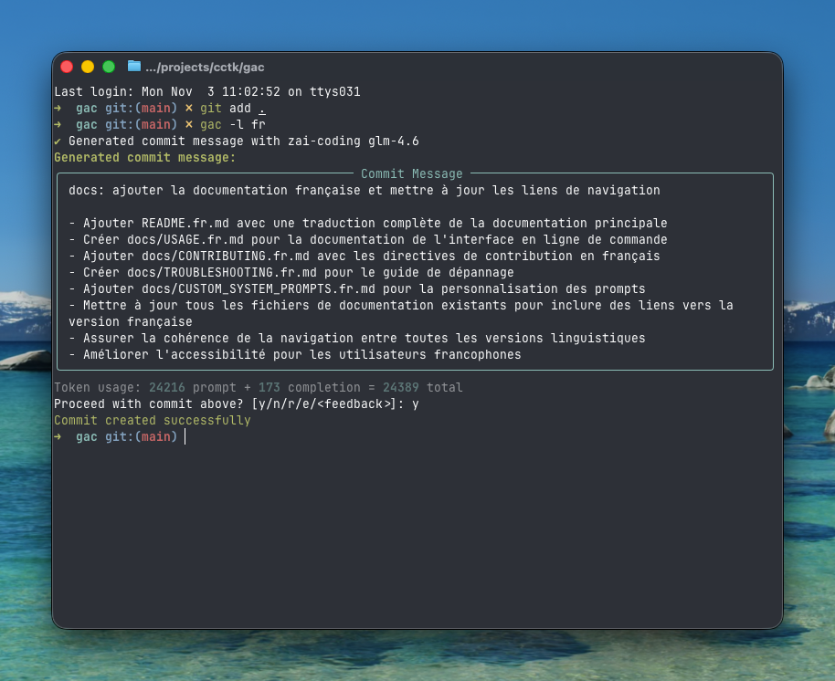

<!-- markdownlint-disable MD013 -->
<!-- markdownlint-disable MD033 MD036 -->

<div align="center">

# 🚀 Git Auto Commit (gac)

[](https://pypi.org/project/gac/)
[](https://www.python.org/downloads/)
[](https://github.com/cellwebb/gac/actions)
[](https://app.codecov.io/gh/cellwebb/gac)
[](https://github.com/astral-sh/ruff)
[](https://mypy-lang.org/)
[](docs/fr/CONTRIBUTING.md)
[](LICENSE)

[English](../../README.md) | [简体中文](../zh-CN/README.md) | [繁體中文](../zh-TW/README.md) | [日本語](../ja/README.md) | [한국어](../ko/README.md) | [हिन्दी](../hi/README.md) | [Tiếng Việt](../vi/README.md) | **Français** | [Русский](../ru/README.md) | [Español](../es/README.md) | [Português](../pt/README.md) | [Norsk](../no/README.md) | [Svenska](../sv/README.md) | [Deutsch](../de/README.md) | [Nederlands](../nl/README.md) | [Italiano](../it/README.md)

**Messages de commit alimentés par l'IA qui comprennent votre code !**

**Automatisez vos commits !** Remplacez `git commit -m "..."` par `gac` pour obtenir des messages de commit contextuels et bien formatés générés par des grands modèles de langage !

---

## Ce que vous obtenez

Des messages intelligents et contextuels qui expliquent le **pourquoi** derrière vos changements :



---

</div>

<!-- markdownlint-enable MD033 MD036 -->

## Démarrage rapide

### Utiliser gac sans l'installer

```bash
uvx gac init   # Configurez votre fournisseur, votre modèle et votre langue
uvx gac  # Générez et commitez avec l'IA
```

C'est tout ! Vérifiez le message généré et confirmez avec `y`.

### Installer et utiliser gac

```bash
uv tool install gac
gac init
gac
```

### Mettre à niveau gac installé

```bash
uv tool upgrade gac
```

---

## Fonctionnalités principales

### 🌐 **Plus de 25 Fournisseurs pris en charge**

- **Anthropic** • **Azure OpenAI** • **Cerebras** • **Chutes.ai** • **Claude Code (OAuth)**
- **DeepSeek** • **Fireworks** • **Gemini** • **Groq** • **Kimi for Coding** • **LM Studio**
- **MiniMax.io** • **Mistral AI** • **Moonshot AI** • **Ollama** • **OpenAI** • **OpenRouter**
- **Qwen.ai (OAuth)** • **Replicate** • **Streamlake** • **Synthetic.new** • **Together AI**
- **Z.AI** • **Z.AI Coding** • **Custom Endpoints (Anthropic/OpenAI)**

### 🧠 **Analyse intelligente par l'IA**

- **Comprend l'intention** : Analyse la structure, la logique et les motifs du code pour comprendre le "pourquoi" derrière vos changements, pas seulement ce qui a changé
- **Conscience sémantique** : Reconnaît les refactorisations, corrections de bugs, fonctionnalités et changements cassants pour générer des messages contextuellement appropriés
- **Filtrage intelligent** : Donne la priorité aux changements significatifs tout en ignorant les fichiers générés, dépendances et artefacts
- **Regroupement intelligent des commits** - Regroupe automatiquement les changements connexes en plusieurs commits logiques avec `--group`

### 📝 **Formats de messages multiples**

- **Une ligne** (-o) : Message de commit sur une seule ligne suivant le format de commit conventionnel
- **Standard** (par défaut) : Résumé avec points expliquant les détails d'implémentation
- **Détaillé** (-v) : Explications complètes incluant motivation, approche technique et analyse d'impact

### 🌍 **Support multilingue**

- **25+ langues** : Générez des messages de commit en anglais, chinois, japonais, coréen, espagnol, français, allemand et 20+ autres langues
- **Traduction flexible** : Choisissez de conserver les préfixes de commits conventionnels en anglais pour la compatibilité des outils, ou traduisez-les entièrement
- **Workflows multiples** : Définissez une langue par défaut avec `gac language`, ou utilisez le drapeau `-l <langue>` pour des remplacements ponctuels
- **Support des scripts natifs** : Support complet des scripts non latins incluant CJK, cyrillique, thaï et plus

### 💻 **Expérience développeur**

- **Feedback interactif** : Tapez `r` pour relancer, `e` pour éditer sur place avec les bindings vi/emacs, ou tapez directement votre feedback comme "rends-le plus court" ou "concentre-toi sur la correction du bug"
- **Interrogation interactive** : Utilisez `--interactive` (`-i`) pour répondre à des questions ciblées sur vos changements pour des messages de commit plus contextuels
- **Workflows en une commande** : Workflows complets avec des drapeaux comme `gac -ayp` (indexer tout, confirmer automatiquement, pousser)
- **Intégration Git** : Respecte les hooks pre-commit et lefthook, en les exécutant avant les opérations coûteuses de l'IA

### 🛡️ **Sécurité intégrée**

- **Détection automatique de secrets** : Analyse les clés API, mots de passe et jetons avant le commit
- **Protection interactive** : Demande confirmation avant de commiter des données potentiellement sensibles avec des options de remédiation claires
- **Filtrage intelligent** : Ignore les fichiers d'exemple, fichiers de modèle et texte de remplacement pour réduire les faux positifs

---

## Exemples d'utilisation

### Workflow de base

```bash
# Indexez vos changements
git add .

# Générez et commitez avec l'IA
gac

# Vérifiez → y (commit) | n (annuler) | r (relancer) | e (éditer) | ou tapez votre feedback
```

### Commandes courantes

| Commande          | Description                                                             |
| ----------------- | ----------------------------------------------------------------------- |
| `gac`             | Générer un message de commit                                            |
| `gac -y`          | Confirmer automatiquement (pas de vérification nécessaire)              |
| `gac -a`          | Indexer tout avant de générer le message de commit                      |
| `gac -o`          | Message sur une ligne pour les changements triviaux                     |
| `gac -v`          | Format détaillé avec Motivation, Approche technique et Analyse d'impact |
| `gac -h "indice"` | Ajouter du contexte pour l'IA (ex: `gac -h "correction de bug"`)        |
| `gac -s`          | Inclure une portée (ex: feat(auth):)                                    |
| `gac -i`          | Poser des questions sur les changements pour un meilleur contexte       |
| `gac -p`          | Commiter et pousser                                                     |

### Exemples pour utilisateurs avancés

```bash
# Workflow complet en une commande
gac -ayp -h "préparation de release"

# Explication détaillée avec portée
gac -v -s

# Message rapide sur une ligne pour petits changements
gac -o

# Grouper les changements en commits logiquement liés
gac -ag

# Mode interactif avec sortie détaillée pour des explications détaillées
gac -iv

# Déboguer ce que voit l'IA
gac --show-prompt

# Ignorer l'analyse de sécurité (utiliser avec prudence)
gac --skip-secret-scan
```

### Système de feedback interactif

Pas satisfait du résultat ? Vous avez plusieurs options :

```bash
# Relancer simple (pas de feedback)
r

# Éditer sur place avec édition de terminal riche
e
# Utilise prompt_toolkit pour l'édition multi-lignes avec les bindings vi/emacs
# Appuyez sur Esc+Entrée ou Ctrl+S pour soumettre, Ctrl+C pour annuler

# Ou tapez simplement votre feedback directement !
rends-le plus court et concentre-toi sur l'amélioration des performances
utilise le format de commit conventionnel avec portée
explique les implications de sécurité

# Appuyez sur Entrée sur une entrée vide pour voir l'invite à nouveau
```

La fonction d'édition (`e`) fournit une édition riche sur place dans le terminal, vous permettant de :

- **Éditer naturellement** : Édition multi-lignes avec les bindings vi/emacs familiers
- **Apporter des corrections rapides** : Corriger les fautes de frappe, ajuster le wording ou affiner le formatage
- **Ajouter des détails** : Inclure des informations que l'IA aurait pu manquer
- **Restructurer** : Réorganiser les points ou changer la structure du message

---

## Configuration

Exécutez `gac init` pour configurer votre fournisseur de manière interactive, ou définissez les variables d'environnement :

Besoin de changer de fournisseurs ou de modèles plus tard sans toucher aux paramètres de langue ? Utilisez `gac model` pour un flux simplifié qui saute les questions de langue.

```bash
# Exemple de configuration
GAC_MODEL=anthropic:your-model-name
OPENAI_API_KEY=your_key_here
ANTHROPIC_API_KEY=your_key_here
```

Voir `.gac.env.example` pour toutes les options disponibles.

**Vous voulez des messages de commit dans une autre langue ?** Exécutez `gac language` pour sélectionner parmi 25+ langues incluant Español, Français, 日本語 et plus.

**Vous voulez personnaliser le style des messages de commit ?** Voir [docs/CUSTOM_SYSTEM_PROMPTS.md](docs/fr/CUSTOM_SYSTEM_PROMPTS.md) pour des conseils sur la récitation de prompts système personnalisés.

---

## Analytics de projet

📊 **[Voir les analytics d'utilisation et statistiques en direct →](https://clickpy.clickhouse.com/dashboard/gac)**

Suivez les métriques d'installation en temps réel et les statistiques de téléchargement de paquets.

---

## Obtenir de l'aide

- **Documentation complète** : [USAGE.md](docs/fr/USAGE.md) - Référence CLI complète
- **Claude Code OAuth** : [docs/CLAUDE_CODE.md](docs/fr/CLAUDE_CODE.md) - Configuration et authentification de Claude Code
- **Qwen.ai OAuth** : [docs/QWEN.md](docs/fr/QWEN.md) - Configuration et authentification de Qwen.ai
- **Prompts personnalisés** : [CUSTOM_SYSTEM_PROMPTS.md](docs/fr/CUSTOM_SYSTEM_PROMPTS.md) - Personnaliser le style des messages de commit
- **Dépannage** : [TROUBLESHOOTING.md](docs/fr/TROUBLESHOOTING.md) - Problèmes courants et solutions
- **Contribuer** : [CONTRIBUTING.md](docs/fr/CONTRIBUTING.md) - Configuration de développement et lignes directrices

---

<!-- markdownlint-disable MD033 MD036 -->

<div align="center">

Fait avec ❤️ pour les développeurs qui veulent de meilleurs messages de commit

[⭐ Mettez-nous une étoile sur GitHub](https://github.com/cellwebb/gac) • [🐛 Signaler des problèmes](https://github.com/cellwebb/gac/issues) • [📖 Documentation complète](docs/fr/USAGE.md)

</div>

<!-- markdownlint-enable MD033 MD036 -->
