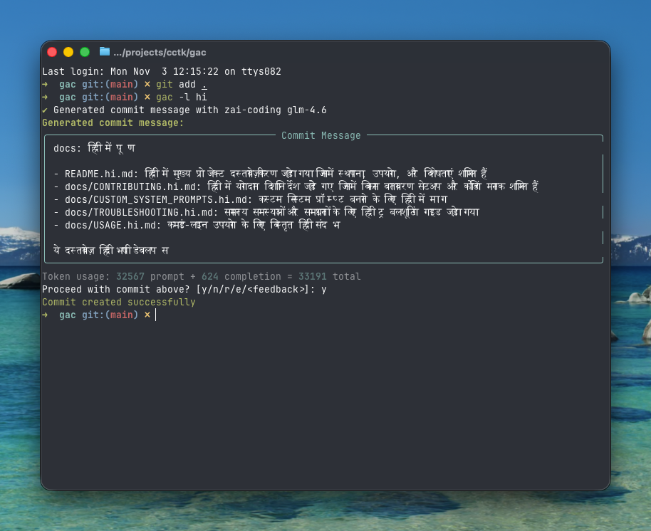

<!-- markdownlint-disable MD013 -->
<!-- markdownlint-disable MD033 MD036 -->

<div align="center">

# 🚀 Git Auto Commit (gac)

[](https://pypi.org/project/gac/)
[](https://www.python.org/downloads/)
[](https://github.com/cellwebb/gac/actions)
[](https://app.codecov.io/gh/cellwebb/gac)
[](https://github.com/astral-sh/ruff)
[](https://mypy-lang.org/)
[](docs/hi/CONTRIBUTING.md)
[](LICENSE)

[English](../../README.md) | [简体中文](../zh-CN/README.md) | [繁體中文](../zh-TW/README.md) | [日本語](../ja/README.md) | [한국어](../ko/README.md) | **हिन्दी** | [Français](../fr/README.md) | [Русский](../ru/README.md) | [Español](../es/README.md) | [Português](../pt/README.md) | [Deutsch](../de/README.md) | [Nederlands](../nl/README.md)

**LLM-संचालित कमिट मैसेज जो आपके कोड को समझते हैं!**

**अपनी कमिट्स को स्वचालित करें!** `git commit -m "..."` को `gac` से बदलें संदर्भात्मक, अच्छी तरह से स्वरूपित कमिट मैसेज के लिए जो बड़े भाषा मॉडल द्वारा जेनरेट किए गए हैं!

---

## आपको क्या मिलता है

बुद्धिमान, संदर्भात्मक मैसेज जो आपके परिवर्तनों के पीछे के "क्यों" को समझाते हैं:



---

</div>

<!-- markdownlint-enable MD033 MD036 -->

<!-- markdownlint-enable MD033 MD036 -->

## शीघ्र शुरुआत

### gac को बिना इंस्टॉल किए उपयोग करें

```bash
uvx gac init   # अपने प्रोवाइडर, मॉडल, और भाषा को कॉन्फिगर करें
uvx gac model  # भाषा प्रॉम्प्ट के बिना प्रोवाइडर/मॉडल सेटअप को फिर से चलाएं
uvx gac  # LLM के साथ जेनरेट और कमिट करें
```

बस इतना ही! जेनरेट किए गए मैसेज की समीक्षा करें और `y` के साथ पुष्टि करें।

### gac को इंस्टॉल करें और उपयोग करें

```bash
uv tool install gac
gac init
gac model
gac
```

### इंस्टॉल किए गए gac को अपग्रेड करें

```bash
uv tool upgrade gac
```

---

## मुख्य विशेषताएं

### 🌐 **समर्थित प्रोवाइडर्स**

- **Anthropic** • **Cerebras** • **Chutes.ai** • **DeepSeek** • **Fireworks**
- **Gemini** • **Groq** • **LM Studio** • **MiniMax** • **Mistral** • **Ollama** • **OpenAI**
- **OpenRouter** • **Streamlake** • **Synthetic.new** • **Together AI**
- **Z.AI** • **Z.AI Coding** • **कस्टम एंडपॉइंट्स (Anthropic/OpenAI)**

### 🧠 **स्मार्ट LLM विश्लेषण**

- **इरादा समझता है**: कोड संरचना, लॉजिक, और पैटर्न का विश्लेषण करके आपके परिवर्तनों के पीछे के "क्यों" को समझता है, न कि केवल क्या बदला
- **सिमेंटिक जागरूकता**: रिफैक्टरिंग, बग फिक्सेस, फीचर्स, और ब्रेकिंग चेंजेस को पहचानता है संदर्भात्मक रूप से उपयुक्त मैसेज जेनरेट करने के लिए
- **बुद्धिमान फिल्टरिंग**: सार्थक परिवर्तनों को प्राथमिकता देता है जबकि जेनरेट किए गए फाइलों, डिपेंडेंसीज, और आर्टिफैक्ट्स को नजरअंदाज करता है
- **बुद्धिमान कमिट ग्रुपिंग** - `--group` के साथ संबंधित परिवर्तनों को स्वचालित रूप से कई लॉजिकल कमिट्स में समूहित करें

### 📝 **कई मैसेज फॉर्मेट**

- **वन-लाइनर** (-o flag): कन्वेंशनल कमिट फॉर्मेट का अनुसरण करते हुए सिंगल-लाइन कमिट मैसेज
- **स्टैंडर्ड** (default): इम्प्लीमेंटेशन विवरण समझाने वाले बुलेट पॉइंट्स के साथ सारांश
- **वर्बोज** (-v flag): प्रेरणा, तकनीकी दृष्टिकोण, और प्रभाव विश्लेषण सहित व्यापक स्पष्टीकरण

### 🌍 **बहुभाषी समर्थन**

- **25+ भाषाएं**: अंग्रेजी, चीनी, जापानी, कोरियाई, स्पैनिश, फ्रेंच, जर्मन, और 20+ और भाषाओं में कमिट मैसेज जेनरेट करें
- **लचीला अनुवाद**: टूल संगतता के लिए कन्वेंशनल कमिट प्रीफिक्सेस को अंग्रेजी में रखने का विकल्प चुनें, या उन्हें पूरी तरह से अनुवाद करें
- **कई वर्कफ्लोज़**: `gac language` के साथ डिफ़ॉल्ट भाषा सेट करें, या एक बार के ओवरराइड के लिए `-l <language>` फ्लैग का उपयोग करें
- **नेटिव स्क्रिप्ट समर्थन**: CJK, सिरिलिक, अरबी, और अन्य सहित गैर-लैटिन स्क्रिप्ट्स के लिए पूर्ण समर्थन

### 💻 **डेवलपर अनुभव**

- **इंटरैक्टिव फीडबैक**: रीरोल के लिए `r` टाइप करें, vi/emacs कीबाइंडिंग के साथ इन-प्लेस एडिट करने के लिए `e`, या सीधे `make it shorter` या `focus on the bug fix` जैसी अपनी फीडबैक टाइप करें
- **वन-कमांड वर्कफ्लोज़**: `gac -ayp` (सभी को स्टेज करें, ऑटो-कन्फर्म करें, पुश करें) जैसे फ्लैग्स के साथ पूर्ण वर्कफ्लोज़
- **Git इंटीग्रेशन**: प्री-कमिट और लेफ्थुक हुक्स का सम्मान करता है, महंगे LLM ऑपरेशन से पहले उन्हें चलाता है

### 🛡️ **बिल्ट-इन सुरक्षा**

- **स्वचालित रहस्य detectiion**: कमिट करने से पहले API कीज, पासवर्ड, और टोकन के लिए स्कैन करता है
- **इंटरैक्टिव सुरक्षा**: संभावित संवेदनशील डेटा को कमिट करने से पहले स्पष्ट उपचार विकल्पों के साथ प्रॉम्प्ट करता है
- **स्मार्ट फिल्टरिंग**: उदाहरण फाइलों, टेम्प्लेट फाइलों, और प्लेसहोल्डर टेक्स्ट को नजरअंदाज करता है झूठी सकारात्मकताओं को कम करने के लिए

---

## उपयोग के उदाहरण

### बेसिक वर्कफ्लो

```bash
# अपने परिवर्तनों को स्टेज करें
git add .

# LLM के साथ जेनरेट और कमिट करें
gac

# समीक्षा → y (कमिट) | n (रद्द करें) | r (रीरोल) | e (एडिट) | या फीडबैक टाइप करें
```

### सामान्य कमांड्स

| Command         | Description                                                         |
| --------------- | ------------------------------------------------------------------- |
| `gac`           | कमिट मैसेज जेनरेट करें                                              |
| `gac -y`        | ऑटो-कन्फर्म (समीक्षा की आवश्यकता नहीं)                              |
| `gac -a`        | कमिट मैसेज जेनरेट करने से पहले सभी को स्टेज करें                    |
| `gac -o`        | तुच्छ परिवर्तनों के लिए वन-लाइन मैसेज                               |
| `gac -v`        | प्रेरणा, तकनीकी दृष्टिकोण, और प्रभाव विश्लेषण के साथ वर्बोज फॉर्मेट |
| `gac -h "hint"` | LLM के लिए संदर्भ जोड़ें (जैसे, `gac -h "bug fix"`)                 |
| `gac -s`        | स्कोप शामिल करें (जैसे, feat(auth):)                                |
| `gac -p`        | कमिट और पुश करें                                                    |

### पावर यूजर उदाहरण

```bash
# एक कमांड में पूरा वर्कफ्लो
gac -ayp -h "release preparation"

# स्कोप के साथ विस्तृत स्पष्टीकरण
gac -v -s

# छोटे परिवर्तनों के लिए त्वरित वन-लाइनर
gac -o

# परिवर्तनों को लॉजिकल रूप से संबंधित कमिट्स में समूहित करें
gac -ag

# डीबग करें कि LLM क्या देखता है
gac --show-prompt

# सुरक्षा स्कैन छोड़ें (सावधानी से उपयोग करें)
gac --skip-secret-scan
```

### इंटरैक्टिव फीडबैक सिस्टम

परिणाम से संतुष्ट नहीं? आपके पास कई विकल्प हैं:

```bash
# सिंपल रीरोल (कोई फीडबैक नहीं)
r

# रिच टर्मिनल एडिटिंग के साथ इन-प्लेस एडिट
e
# vi/emacs कीबाइंडिंग के साथ मल्टी-लाइन एडिटिंग के लिए prompt_toolkit का उपयोग करता है
# सबमिट करने के लिए Esc+Enter या Ctrl+S दबाएं, रद्द करने के लिए Ctrl+C

# या बस अपनी फीडबैक सीधे टाइप करें!
make it shorter and focus on the performance improvement
use conventional commit format with scope
explain the security implications

# प्रॉम्प्ट को फिर से देखने के लिए खाली इनपुट पर Enter दबाएं
```

एडिट फीचर (`e`) रिच इन-प्लेस टर्मिनल एडिटिंग प्रदान करता है, जिससे आप:

- **स्वाभाविक रूप से एडिट करें**: परिचित vi/emacs की बाइंडिंग के साथ मल्टी-लाइन एडिटिंग
- **त्वरित फिक्स करें**: टाइपोस को सुधारें, वर्डिंग को एडजस्ट करें, या फॉर्मेटिंग को रिफाइन करें
- **विवरण जोड़ें**: जानकारी शामिल करें जो LLM ने याद किया हो सकता है
- **संरचना बदलें**: बुलेट पॉइंट्स को पुनर्व्यवस्थित करें या मैसेज संरचना को बदलें

---

## कॉन्फिगरेशन

अपने प्रोवाइडर को इंटरैक्टिव रूप से कॉन्फिगर करने के लिए `gac init` चलाएं, या एनवायरमेंट वेरिएबल्स सेट करें:

बाद में प्रोवाइडर या मॉडल बदलने की जरूरत है भाषा सेटिंग्स को छुए बिना? भाषा प्रॉम्प्ट को छोड़ने वाली स्ट्रीमलाइन फ्लो के लिए `gac model` का उपयोग करें।

```bash
# उदाहरण कॉन्फिगरेशन
GAC_MODEL=anthropic:your-model-name
OPENAI_API_KEY=your_key_here
ANTHROPIC_API_KEY=your_key_here
```

सभी उपलब्ध विकल्पों के लिए `.gac.env.example` देखें।

**दूसरी भाषा में कमिट मैसेज चाहिए?** Español, Français, 日本語, और अन्य सहित 25+ भाषाओं में से चुनने के लिए `gac language` चलाएं।

**कमिट मैसेज स्टाइल को कस्टमाइज़ करना चाहते हैं?** कस्टम सिस्टम प्रॉम्प्ट्स लिखने पर मार्गदर्शन के लिए [docs/CUSTOM_SYSTEM_PROMPTS.md](docs/hi/CUSTOM_SYSTEM_PROMPTS.md) देखें।

---

## प्रोजेक्ट एनालिटिक्स

📊 **[लाइव उपयोग एनालिटिक्स और आँकड़े देखें →](https://clickpy.clickhouse.com/dashboard/gac)**

रीयल-टाइम इंस्टॉलेशन मेट्रिक्स और पैकेज डाउनलोड आँकड़ों को ट्रैक करें।

---

## सहायता प्राप्त करना

- **पूर्ण दस्तावेज़**: [USAGE.md](docs/hi/USAGE.md) - पूर्ण CLI रेफरेंस
- **कस्टम प्रॉम्प्ट्स**: [CUSTOM_SYSTEM_PROMPTS.md](docs/hi/CUSTOM_SYSTEM_PROMPTS.md) - कमिट मैसेज स्टाइल को कस्टमाइज़ करें
- **समस्या निवारण**: [TROUBLESHOOTING.md](docs/hi/TROUBLESHOOTING.md) - सामान्य समस्याएं और समाधान
- **योगदान**: [CONTRIBUTING.md](docs/hi/CONTRIBUTING.md) - डेवलपमेंट सेटअप और दिशानिर्देश

---

<!-- markdownlint-disable MD033 MD036 -->

<div align="center">

बेहतर कमिट मैसेज चाहने वाले डेवलपर्स के लिए ❤️ के साथ बनाया गया

[⭐ GitHub पर हमें स्टार करें](https://github.com/cellwebb/gac) • [🐛 इश्यू रिपोर्ट करें](https://github.com/cellwebb/gac/issues) • [📖 पूरे डॉक्स](docs/hi/USAGE.md)

</div>

<!-- markdownlint-enable MD033 MD036 -->
