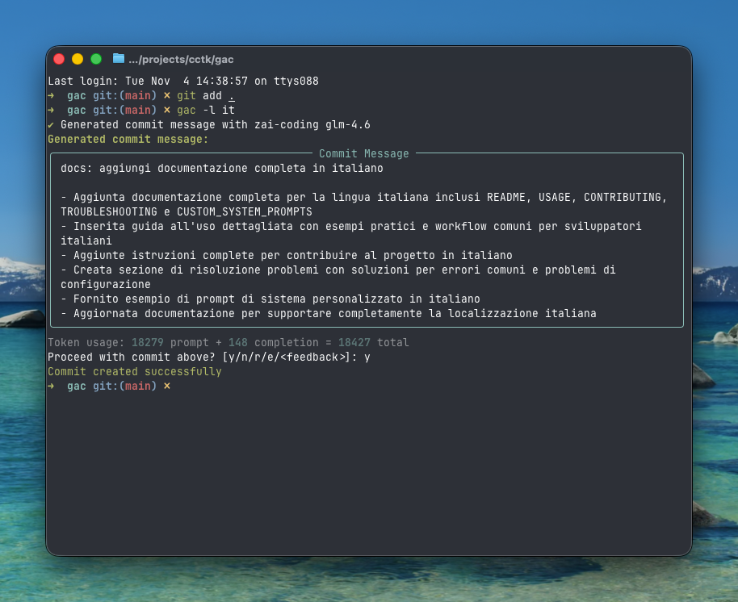

<!-- markdownlint-disable MD013 -->
<!-- markdownlint-disable MD033 MD036 -->

<div align="center">

# 🚀 Git Auto Commit (gac)

[](https://pypi.org/project/gac/)
[](https://www.python.org/downloads/)
[](https://github.com/cellwebb/gac/actions)
[](https://app.codecov.io/gh/cellwebb/gac)
[](https://github.com/astral-sh/ruff)
[](https://mypy-lang.org/)
[](docs/it/CONTRIBUTING.md)
[](LICENSE)

[English](../../README.md) | [简体中文](../zh-CN/README.md) | [繁體中文](../zh-TW/README.md) | [日本語](../ja/README.md) | [한국어](../ko/README.md) | [हिन्दी](../hi/README.md) | [Tiếng Việt](../vi/README.md) | [Français](../fr/README.md) | [Русский](../ru/README.md) | [Español](../es/README.md) | [Português](../pt/README.md) | [Norsk](../no/README.md) | [Svenska](../sv/README.md) | [Deutsch](../de/README.md) | [Nederlands](../nl/README.md) | **Italiano**

**Messaggi di commit generati da LLM che capiscono il tuo codice!**

**Automatizza i tuoi commit!** Sostituisci `git commit -m "..."` con `gac` per ottenere messaggi di commit contestuali e ben formattati generati da grandi modelli linguistici!

---

## Cosa Ottieni

Messaggi intelligenti e contestuali che spiegano il **perché** dietro le tue modifiche:



---

</div>

<!-- markdownlint-enable MD033 MD036 -->

## Avvio Rapido

### Usa gac senza installarlo

```bash
uvx gac init   # Configura il tuo provider, modello e lingua
uvx gac  # Genera e fai commit con LLM
```

Questo è tutto! Rivedi il messaggio generato e conferma con `y`.

### Installa e usa gac

```bash
uv tool install gac
gac init
gac
```

### Aggiorna gac installato

```bash
uv tool upgrade gac
```

---

## Funzionalità Principali

### 🌐 **25+ Provider Supportati**

- **Anthropic** • **Azure OpenAI** • **Cerebras** • **Chutes.ai** • **Claude Code (OAuth)**
- **DeepSeek** • **Fireworks** • **Gemini** • **Groq** • **Kimi for Coding** • **LM Studio**
- **MiniMax.io** • **Mistral AI** • **Moonshot AI** • **Ollama** • **OpenAI** • **OpenRouter**
- **Replicate** • **Streamlake** • **Synthetic.new** • **Together AI** • **Z.AI** • **Z.AI Coding**
- **Custom Endpoints (Anthropic/OpenAI)**

### 🧠 **Analisi Intelligente LLM**

- **Capisce l'intento**: Analizza la struttura, la logica e i pattern del codice per capire il "perché" dietro le tue modifiche, non solo cosa è cambiato
- **Consapevolezza semantica**: Riconosce refactoring, correzioni di bug, funzionalità e modifiche breaking per generare messaggi contestualmente appropriati
- **Filtraggio intelligente**: Dà priorità alle modifiche significative ignorando file generati, dipendenze e artefatti
- **Raggruppamento intelligente dei commit** - Raggruppa automaticamente modifiche correlate in più commit logici con `--group`

### 📝 **Formati di Messaggio Multipli**

- **Una riga** (flag -o): Messaggio di commit su una singola riga seguendo il formato conventional commit
- **Standard** (predefinito): Riepilogo con punti elenco che spiegano i dettagli di implementazione
- **Dettagliato** (flag -v): Spiegazioni complete inclusi motivazione, approccio tecnico e analisi dell'impatto

### 🌍 **Supporto Multilingue**

- **25+ lingue**: Genera messaggi di commit in inglese, cinese, giapponese, coreano, spagnolo, francese, tedesco, italiano e 20+ altre lingue
- **Traduzione flessibile**: Scegli di mantenere i prefissi dei commit convenzionali in inglese per la compatibilità degli strumenti, o tradurli completamente
- **Workflow multipli**: Imposta una lingua predefinita con `gac language`, o usa il flag `-l <lingua>` per override una tantum
- **Supporto script nativi**: Supporto completo per script non latini inclusi CJK, cirillico, thai e altri

### 💻 **Esperienza Sviluppatore**

- **Feedback interattivo**: Digita `r` per rilanciare, `e` per modificare sul posto con binding vi/emacs, o digita direttamente il tuo feedback come "rendilo più breve" o "concentrati sulla correzione del bug"
- **Interrogazione interattiva**: Usa `--interactive` (`-i`) per rispondere a domande mirate sulle tue modifiche per messaggi di commit più contestuali
- **Workflow a comando singolo**: Workflow completi con flag come `gac -ayp` (staging tutto, auto-conferma, push)
- **Integrazione Git**: Rispetta gli hook pre-commit e lefthook, eseguendoli prima delle operazioni costose del LLM

### 🛡️ **Sicurezza Integrata**

- **Rilevamento automatico dei segreti**: Scansiona chiavi API, password e token prima del commit
- **Protezione interattiva**: Chiede conferma prima di fare il commit di dati potenzialmente sensibili con opzioni di rimedio chiare
- **Filtraggio intelligente**: Ignora file di esempio, file template e testo segnaposto per ridurre i falsi positivi

---

## Esempi di Utilizzo

### Workflow Base

```bash
# Fai lo staging delle tue modifiche
git add .

# Genera e fai il commit con LLM
gac

# Rivedi → y (commit) | n (annulla) | r (rilancia) | e (modifica) | o digita feedback
```

### Comandi Comuni

| Comando         | Descrizione                                                              |
| --------------- | ------------------------------------------------------------------------ |
| `gac`           | Genera messaggio di commit                                               |
| `gac -y`        | Auto-conferma (nessuna revisione necessaria)                             |
| `gac -a`        | Fai lo staging di tutto prima di generare il messaggio di commit         |
| `gac -o`        | Messaggio su una riga per modifiche banali                               |
| `gac -v`        | Formato dettagliato con Motivazione, Approccio Tecnico e Analisi Impatto |
| `gac -h "hint"` | Aggiungi contesto per LLM (es: `gac -h "correzione bug"`)                |
| `gac -s`        | Includi scope (es: feat(auth):)                                          |
| `gac -i`        | Fai domande sulle modifiche per un contesto migliore                     |
| `gac -p`        | Fai il commit e push                                                     |

### Esempi per Utenti Avanzati

```bash
# Workflow completo in un comando
gac -ayp -h "preparazione release"

# Spiegazione dettagliata con scope
gac -v -s

# Messaggio rapido su una riga per piccole modifiche
gac -o

# Raggruppa modifiche in commit logicamente correlati
gac -ag

# Modalità interattiva con output dettagliato per spiegazioni dettagliate
gac -iv

# Debug di ciò che vede il LLM
gac --show-prompt

# Salta scansione sicurezza (usa con cautela)
gac --skip-secret-scan
```

### Sistema di Feedback Interattivo

Non soddisfatto del risultato? Hai diverse opzioni:

```bash
# Rilancio semplice (nessun feedback)
r

# Modifica sul posto con editing ricco del terminale
e
# Usa prompt_toolkit per editing multi-riga con binding vi/emacs
# Premi Esc+Invio o Ctrl+S per inviare, Ctrl+C per annullare

# O digita semplicemente il tuo feedback direttamente!
rendilo più breve e concentrati sul miglioramento delle prestazioni
usa il formato conventional commit con scope
spiega le implicazioni di sicurezza

# Premi Invio su input vuoto per vedere di nuovo il prompt
```

La funzione di modifica (`e`) fornisce editing ricco sul posto nel terminale, permettendoti di:

- **Modificare naturalmente**: Editing multi-riga con binding vi/emacs familiari
- **Fare correzioni rapide**: Correggi errori di battitura, aggiusta il wording o rifina la formattazione
- **Aggiungere dettagli**: Includi informazioni che il LLM potrebbe aver perso
- **Ristrutturare**: Riorganizza i punti elenco o cambia la struttura del messaggio

---

## Configurazione

Esegui `gac init` per configurare il tuo provider interattivamente, o imposta le variabili d'ambiente:

Hai bisogno di cambiare provider o modelli più tardi senza toccare le impostazioni di lingua? Usa `gac model` per un flusso semplificato che salta i prompt di lingua.

```bash
# Esempio di configurazione
GAC_MODEL=anthropic:your-model-name
OPENAI_API_KEY=your_key_here
ANTHROPIC_API_KEY=your_key_here
```

Vedi `.gac.env.example` per tutte le opzioni disponibili.

**Vuoi messaggi di commit in un'altra lingua?** Esegui `gac language` per selezionare tra 25+ lingue inclusi Español, Français, 日本語, e altre.

**Vuoi personalizzare lo stile dei messaggi di commit?** Vedi [docs/CUSTOM_SYSTEM_PROMPTS.md](docs/it/CUSTOM_SYSTEM_PROMPTS.md) per guide sulla scrittura di prompt di sistema personalizzati.

---

## Analytics del Progetto

📊 **[Vedi analytics di utilizzo live e statistiche →](https://clickpy.clickhouse.com/dashboard/gac)**

Traccia metriche di installazione in tempo reale e statistiche di download dei pacchetti.

---

## Ottenere Aiuto

- **Documentazione completa**: [docs/USAGE.md](docs/it/USAGE.md) - Riferimento CLI completo
- **Prompt personalizzati**: [docs/CUSTOM_SYSTEM_PROMPTS.md](docs/it/CUSTOM_SYSTEM_PROMPTS.md) - Personalizza lo stile dei messaggi di commit
- **Risoluzione problemi**: [docs/TROUBLESHOOTING.md](docs/it/TROUBLESHOOTING.md) - Problemi comuni e soluzioni
- **Contribuire**: [docs/CONTRIBUTING.md](docs/it/CONTRIBUTING.md) - Setup di sviluppo e linee guida

---

<!-- markdownlint-disable MD033 MD036 -->

<div align="center">

Fatto con ❤️ per sviluppatori che vogliono messaggi di commit migliori

[⭐ Metti una stella su GitHub](https://github.com/cellwebb/gac) • [🐛 Segnala problemi](https://github.com/cellwebb/gac/issues) • [📖 Documentazione completa](docs/it/USAGE.md)

</div>

<!-- markdownlint-enable MD033 MD036 -->
