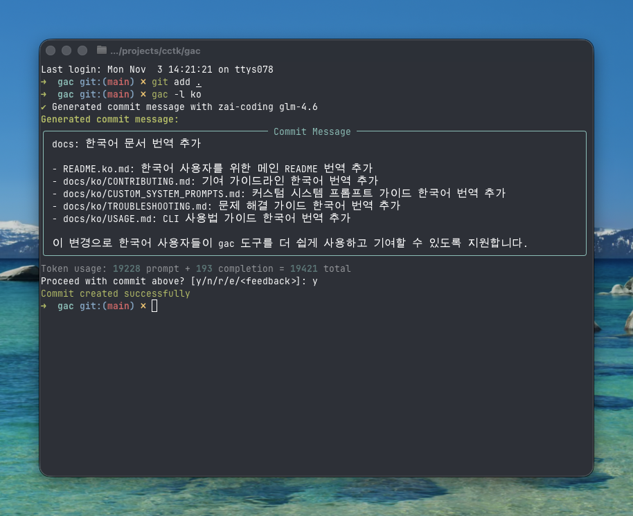

<!-- markdownlint-disable MD013 -->
<!-- markdownlint-disable MD033 MD036 -->

<div align="center">

# 🚀 Git Auto Commit (gac)

[](https://pypi.org/project/gac/)
[](https://www.python.org/downloads/)
[](https://github.com/cellwebb/gac/actions)
[](https://app.codecov.io/gh/cellwebb/gac)
[](https://github.com/astral-sh/ruff)
[](https://mypy-lang.org/)
[](docs/ko/CONTRIBUTING.md)
[](LICENSE)

[English](../../README.md) | [简体中文](../zh-CN/README.md) | [繁體中文](../zh-TW/README.md) | [日本語](../ja/README.md) | **한국어** | [हिन्दी](../hi/README.md) | [Tiếng Việt](../vi/README.md) | [Français](../fr/README.md) | [Русский](../ru/README.md) | [Español](../es/README.md) | [Português](../pt/README.md) | [Norsk](../no/README.md) | [Svenska](../sv/README.md) | [Deutsch](../de/README.md) | [Nederlands](../nl/README.md) | [Italiano](../it/README.md)

**코드를 이해하는 LLM 기반 커밋 메시지!**

**커밋을 자동화하세요!** `git commit -m "..."` 대신 `gac`를 사용하여 대규모 언어 모델이 생성하는 맥락적이고 잘 포맷된 커밋 메시지를 받으세요!

---

## 무엇을 얻을 수 있나요?

변경 사항背后的 **이유**를 설명하는 지능적이고 맥락적인 메시지:



---

</div>

<!-- markdownlint-enable MD033 MD036 -->

## 빠른 시작

### 설치 없이 gac 사용하기

```bash
uvx gac init   # 공급자, 모델, 언어 구성
uvx gac  # LLM으로 생성 및 커밋
```

이게 전부입니다! 생성된 메시지를 검토하고 `y`로 확인하세요.

### 설치하고 gac 사용하기

```bash
uv tool install gac
gac init
gac
```

### 설치된 gac 업그레이드

```bash
uv tool upgrade gac
```

---

## 주요 기능

### 🌐 **지원되는 공급자**

- **Anthropic** • **Cerebras** • **Chutes.ai** • **Claude Code**
- **DeepSeek** • **Fireworks** • **Gemini** • **Groq** • **LM Studio**
- **MiniMax** • **Mistral** • **Ollama** • **OpenAI** • **OpenRouter**
- **Streamlake** • **Synthetic.new** • **Together AI**
- **Z.AI** • **Z.AI Coding** • **사용자 정의 엔드포인트 (Anthropic/OpenAI)**

### 🧠 **스마트 LLM 분석**

- **의도 이해**: 코드 구조, 로직, 패턴을 분석하여 변경된 내용뿐만 아니라 변경背后的 이유를 이해
- **의미 인식**: 리팩토링, 버그 수정, 기능, 호환성 깨지는 변경을 인식하여 맥락적으로 적절한 메시지 생성
- **지능적 필터링**: 생성된 파일, 의존성, 아티팩트를 무시하면서 의미 있는 변경 우선순위 지정
- **지능적 커밋 그룹화** - `--group`을 사용하여 관련 변경을 여러 논리적 커밋으로 자동 그룹화

### 📝 **다양한 메시지 형식**

- **한 줄 요약** (-o 플래그): 컨벤셔널 커밋 형식을 따르는 한 줄 커밋 메시지
- **표준** (기본값): 구현 세부사항을 설명하는 불렛 포인트가 포함된 요약
- **상세** (-v 플래그): 동기, 기술적 접근 방식, 영향 분석을 포함한 포괄적인 설명

### 🌍 **다국어 지원**

- **25개 이상 언어**: 영어, 중국어, 일본어, 한국어, 스페인어, 프랑스어, 독일어 등 20개 이상 언어로 커밋 메시지 생성
- **유연한 번역**: 도구 호환성을 위해 컨벤셔널 커밋 접두사를 영어로 유지하거나 완전히 번역
- **다양한 워크플로우**: `gac language`로 기본 언어 설정 또는 `-l <language>` 플래그로 일회성 재정의
- **네이티브 스크립트 지원**: CJK, 키릴, 아라비아 등 비라틴 스크립트 완전 지원

### 💻 **개발자 경험**

- **상호작용 피드백**: `r`을 입력하여 재생성, `e`를 입력하여 vi/emacs 키바인딩으로 즉석 편집, 또는 `더 짧게 만들어줘`나 `버그 수정에 집중해줘`와 같이 피드백 직접 입력
- **원명령 워크플로우**: `gac -ayp` (모두 스테이징, 자동 확인, 푸시)와 같은 플래그로 완전한 워크플로우
- **Git 통합**: 비싼 LLM 작업 전에 pre-commit 및 lefthook 훅 실행

### 🛡️ **내장 보안**

- **자동 비밀 감지**: 커밋 전에 API 키, 비밀번호, 토큰 스캔
- **상호작용 보호**: 잠재적으로 민감한 데이터를 커밋하기 전에 명확한 수정 옵션으로 프롬프트
- **스마트 필터링**: 예제 파일, 템플릿 파일, 플레이스홀더 텍스트를 무시하여 거짓 양성 감소

---

## 사용 예제

### 기본 워크플로우

```bash
# 변경 사항 스테이징
git add .

# LLM으로 생성하고 커밋
gac

# 검토 → y (커밋) | n (취소) | r (재생성) | e (편집) | 또는 피드백 입력
```

### 일반 명령어

| 명령어          | 설명                                                 |
| --------------- | ---------------------------------------------------- |
| `gac`           | 커밋 메시지 생성                                     |
| `gac -y`        | 자동 확인 (검토 불필요)                              |
| `gac -a`        | 커밋 메시지 생성 전 모두 스테이징                    |
| `gac -o`        | 사소한 변경을 위한 한 줄 메시지                      |
| `gac -v`        | 동기, 기술적 접근 방식, 영향 분석이 포함된 상세 형식 |
| `gac -h "hint"` | LLM을 위한 컨텍스트 추가 (예: `gac -h "버그 수정"`)  |
| `gac -s`        | 범위 포함 (예: feat(auth):)                          |
| `gac -p`        | 커밋하고 푸시                                        |

### 고급 사용자 예제

```bash
# 한 명령어로 완전한 워크플로우
gac -ayp -h "릴리스 준비"

# 범위가 포함된 상세 설명
gac -v -s

# 작은 변경을 위한 빠른 한 줄 요약
gac -o

# 변경을 논리적으로 관련된 커밋으로 그룹화
gac -ag

# LLM이 보는 것 디버그
gac --show-prompt

# 보안 스캔 건너뛰기 (주의해서 사용)
gac --skip-secret-scan
```

### 상호작용 피드백 시스템

결과가 마음에 들지 않으세요? 여러 옵션이 있습니다:

```bash
# 단순 재생성 (피드백 없음)
r

# 풍부한 터미널 편집으로 즉석 편집
e
# vi/emacs 키바인딩으로 다중 라인 편집을 위한 prompt_toolkit 사용
# Esc+Enter 또는 Ctrl+S로 제출, Ctrl+C로 취소

# 또는 피드백을 직접 입력하세요!
더 짧게 만들고 성능 개선에 집중해줘
범위가 포함된 컨벤셔널 커밋 형식 사용해줘
보안 영향 설명해줘

# 빈 입력에서 Enter를 눌러 프롬프트를 다시 보세요
```

편집 기능(`e`)은 풍부한 즉석 터미널 편집을 제공하여 다음을 수행할 수 있습니다:

- **자연스럽게 편집**: 익숙한 vi/emacs 키 바인딩으로 다중 라인 편집
- **빠른 수정**: 오타 수정, 단어 조정, 또는 포맷팅 개선
- **세부사항 추가**: LLM이 놓쳤을 수 있는 정보 포함
- **구조 재구성**: 불렛 포인트 재구성 또는 메시지 구조 변경

---

## 설정

상호작용적으로 공급자를 설정하려면 `gac init`를 실행하거나 환경 변수를 설정하세요:

나중에 언어 설정을 건드리지 않고 공급자나 모델을 변경해야 하나요? 언어 프롬프트를 건너뛰는 간소화된 흐름을 위해 `gac model`를 사용하세요.

```bash
# 설정 예제
GAC_MODEL=anthropic:your-model-name
OPENAI_API_KEY=your_key_here
ANTHROPIC_API_KEY=your_key_here
```

사용 가능한 모든 옵션은 `.gac.env.example`을 참조하세요.

**다른 언어로 커밋 메시지를 원하시나요?** `gac language`를 실행하여 Español, Français, 日本어 등 25개 이상 언어 중에서 선택하세요.

**커밋 메시지 스타일을 사용자 정의하고 싶으신가요?** 사용자 정의 시스템 프롬프트 작성에 대한 안내는 [docs/CUSTOM_SYSTEM_PROMPTS.md](docs/ko/CUSTOM_SYSTEM_PROMPTS.md)를 참조하세요.

---

## 프로젝트 분석

📊 **[실시간 사용 분석 및 통계 보기 →](https://clickpy.clickhouse.com/dashboard/gac)**

실시간 설치 지표 및 패키지 다운로드 통계를 추적하세요.

---

## 도움말 얻기

- **전체 문서**: [docs/USAGE.md](docs/ko/USAGE.md) - 완전한 CLI 참조
- **사용자 정의 프롬프트**: [docs/CUSTOM_SYSTEM_PROMPTS.md](docs/ko/CUSTOM_SYSTEM_PROMPTS.md) - 커밋 메시지 스타일 사용자 정의
- **문제 해결**: [docs/TROUBLESHOOTING.md](docs/ko/TROUBLESHOOTING.md) - 일반적인 문제 및 해결책
- **기여**: [docs/CONTRIBUTING.md](docs/ko/CONTRIBUTING.md) - 개발 설정 및 가이드라인

---

<!-- markdownlint-disable MD033 MD036 -->

<div align="center">

더 나은 커밋 메시지를 원하는 개발자들을 위해 ❤️로 만들었습니다

[⭐ GitHub에서 스타하기](https://github.com/cellwebb/gac) • [🐛 이슈 보고](https://github.com/cellwebb/gac/issues) • [📖 전체 문서](docs/ko/USAGE.md)

</div>

<!-- markdownlint-enable MD033 MD036 -->
