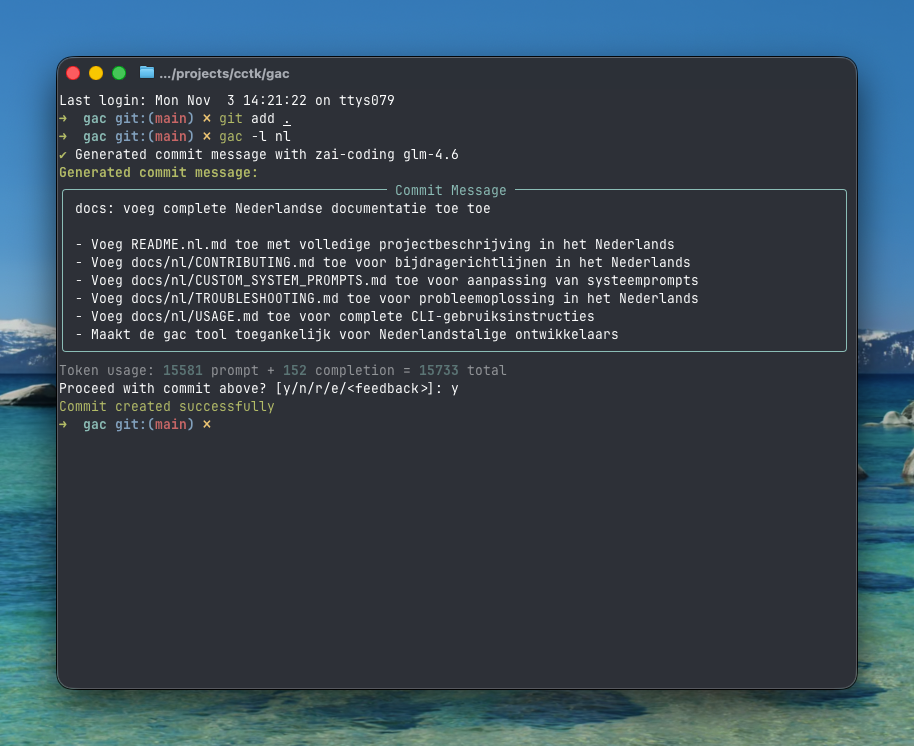

<!-- markdownlint-disable MD013 -->
<!-- markdownlint-disable MD033 MD036 -->

<div align="center">

# 🚀 Git Auto Commit (gac)

[](https://pypi.org/project/gac/)
[](https://www.python.org/downloads/)
[](https://github.com/cellwebb/gac/actions)
[](https://app.codecov.io/gh/cellwebb/gac)
[](https://github.com/astral-sh/ruff)
[](https://mypy-lang.org/)
[](docs/nl/CONTRIBUTING.md)
[](LICENSE)

[English](../../README.md) | [简体中文](../zh-CN/README.md) | [繁體中文](../zh-TW/README.md) | [日本語](../ja/README.md) | [한국어](../ko/README.md) | [हिन्दी](../hi/README.md) | [Tiếng Việt](../vi/README.md) | [Français](../fr/README.md) | [Русский](../ru/README.md) | [Español](../es/README.md) | [Português](../pt/README.md) | [Norsk](../no/README.md) | [Svenska](../sv/README.md) | [Deutsch](../de/README.md) | **Nederlands** | [Italiano](../it/README.md)

**Met LLM-gedreven commitberichten die uw code begrijpen!**

**Automatiseer uw commits!** Vervang `git commit -m "..."` door `gac` voor contextuele, goed geformateerde commitberichten die zijn gegenereerd door grote taalmodellen!

---

## Wat U Krijgt

Intelligente, contextuele berichten die het **waarom** achter uw wijzigingen uitleggen:



---

</div>

<!-- markdownlint-enable MD033 MD036 -->

## Snel Starten

### Gebruik gac zonder installatie

```bash
uvx gac init   # Configureer uw provider, model en taal
uvx gac        # Genereer en commit met LLM
```

Dat is alles! Beoordeel het gegenereerde bericht en bevestig met `y`.

### Installeer en gebruik gac

```bash
uv tool install gac
gac init
gac
```

### Upgrade geïnstalleerde gac

```bash
uv tool upgrade gac
```

---

## Belangrijkste Functies

### 🌐 **25+ Ondersteunde Providers**

- **Anthropic** • **Azure OpenAI** • **Cerebras** • **Chutes.ai** • **Claude Code (OAuth)**
- **DeepSeek** • **Fireworks** • **Gemini** • **Groq** • **Kimi for Coding** • **LM Studio**
- **MiniMax.io** • **Mistral AI** • **Moonshot AI** • **Ollama** • **OpenAI** • **OpenRouter**
- **Qwen.ai (OAuth)** • **Replicate** • **Streamlake** • **Synthetic.new** • **Together AI**
- **Z.AI** • **Z.AI Coding** • **Custom Endpoints (Anthropic/OpenAI)**

### 🧠 **Slimme LLM-analyse**

- **Begrijpt intentie**: Analyseert codestructuur, logica en patronen om het "waarom" achter uw wijzigingen te begrijpen, niet alleen wat er is veranderd
- **Semantisch bewustzijn**: Herkent refactoring, bugfixes, features en breaking changes om contextueel passende berichten te genereren
- **Intelligente filtering**: Prioriteert betekenisvolle wijzigingen en negeert gegenereerde bestanden, dependencies en artefacten
- **Intelligente commit-groepering** - Groepeer automatisch gerelateerde wijzigingen in meerdere logische commits met `--group`

### 📝 **Meerdere Berichtformaten**

- **One-liner** (-o vlag): Eénregelig commitbericht in conventioneel commitformaat
- **Standaard** (standaard): Samenvatting met bullet points die implementatiedetails uitleggen
- **Uitgebreid** (-v vlag): Uitgebreide uitleg inclusief motivatie, technische aanpak en impactanalyse

### 🌍 **Meertalige Ondersteuning**

- **25+ talen**: Genereer commitberichten in Engels, Chinees, Japans, Koreaans, Spaans, Frans, Duits en 20+ andere talen
- **Flexibele vertaling**: Kies ervoor om conventionele commit-prefixen in het Engels te houden voor tool-compatibiliteit, of vertaal ze volledig
- **Meerdere workflows**: Stel een standaardtaal in met `gac language`, of gebruik de `-l <taal>` vlag voor eenmalige overschrijvingen
- **Ondersteuning voor native scripts**: Volledige ondersteuning voor niet-Latijnse scripts inclusief CJK, Cyrillisch, Thai en meer

### 💻 **Ontwikkelervaring**

- **Interactieve feedback**: Typ `r` om opnieuw te rollen, `e` om ter plaat te bewerken met vi/emacs-keybindings, of typ direct uw feedback zoals `maak het korter` of `focus op de bugfix`
- **Interactieve ondervraging**: Gebruik `--interactive` (`-i`) om gerichte vragen over uw wijzigingen te beantwoorden voor meer contextuele commitberichten
- **Één-commando workflows**: Volledige workflows met vlaggen zoals `gac -ayp` (stage alles, auto-bevestig, push)
- **Git-integratie**: Respecteert pre-commit en lefthook hooks en voert ze uit vóór dure LLM-operaties

### 🛡️ **Ingebouwde Beveiliging**

- **Automatische secret-detectie**: Scant op API-sleutels, wachtwoorden en tokens voor het committen
- **Interactieve bescherming**: Vraagt voor het committen van mogelijk gevoelige gegevens met duidelijke herstelopties
- **Slimme filtering**: Negeert voorbeeldbestanden, sjabloonbestanden en plaatshoudertekst om false positives te verminderen

---

## Gebruiksvoorbeelden

### Basisworkflow

```bash
# Stage uw wijzigingen
git add .

# Genereer en commit met LLM
gac

# Beoordeel → y (commit) | n (annuleer) | r (opnieuw rollen) | e (bewerken) | of typ feedback
```

### Veelgebruikte Commando's

| Commando        | Beschrijving                                                         |
| --------------- | -------------------------------------------------------------------- |
| `gac`           | Genereer commitbericht                                               |
| `gac -y`        | Auto-bevestig (geen beoordeling nodig)                               |
| `gac -a`        | Stage alles voordat u commitbericht genereert                        |
| `gac -o`        | Eénregelig bericht voor triviale wijzigingen                         |
| `gac -v`        | Uitgebreid formaat met Motivatie, Technische Aanpak en Impactanalyse |
| `gac -h "hint"` | Voeg context toe voor LLM (bv., `gac -h "bug fix"`)                  |
| `gac -s`        | Inclusief scope (bv., feat(auth):)                                   |
| `gac -i`        | Stel vragen over wijzigingen voor betere context                     |
| `gac -p`        | Commit en push                                                       |

### Power User Voorbeelden

```bash
# Volledige workflow in één commando
gac -ayp -h "release preparation"

# Gedetailleerde uitleg met scope
gac -v -s

# Snelle one-liner voor kleine wijzigingen
gac -o

# Groepeer wijzigingen in logisch gerelateerde commits
gac -ag

# Interactieve modus met gedetailleerde output voor gedetailleerde uitleg
gac -iv

# Debug wat de LLM ziet
gac --show-prompt

# Sla security scan over (gebruik voorzichtig)
gac --skip-secret-scan
```

### Interactief Feedbacksysteem

Niet tevreden met het resultaat? U heeft mehrere opties:

```bash
# Eenvoudige reroll (geen feedback)
r

# Bewerk ter plaatse met rijke terminalbewerking
e
# Gebruikt prompt_toolkit voor meerregelige bewerking met vi/emacs keybindings
# Druk op Esc+Enter of Ctrl+S om in te dienen, Ctrl+C om te annuleren

# Of typ gewoon uw feedback direct!
maak het korter en focus op de prestatieverbetering
gebruik conventioneel commitformaat met scope
leg de security-implicaties uit

# Druk op Enter op lege invoer om de prompt opnieuw te zien
```

De bewerkfunctie (`e`) biedt rijke inplace terminalbewerking, waarmee u kunt:

- **Natuurlijk bewerken**: Meerregelige bewerking met vertrouwde vi/emacs key bindings
- **Snelle fixes**: Typfouten corrigeren, woordkeuze aanpassen, of formattering verfijnen
- **Details toevoegen**: Informatie toevoegen die de LLM mogelijk heeft gemist
- **Herrstructureren**: Bullet points herorganiseren of de berichtstructuur wijzigen

---

## Configuratie

Voer `gac init` uit om uw provider interactief te configureren, of stel omgevingsvariabelen in:

Wilt u later providers of modellen wijzigen zonder taalinstellingen aan te passen? Gebruik `gac model` voor een gestroomlijnde workflow die de taalprompts overslaat.

```bash
# Voorbeeldconfiguratie
GAC_MODEL=anthropic:your-model-name
OPENAI_API_KEY=your_key_here
ANTHROPIC_API_KEY=your_key_here
```

Zie `.gac.env.example` voor alle beschikbare opties.

**Wilt u commitberichten in een andere taal?** Voer `gac language` uit om te kiezen uit 25+ talen inclusief Español, Français, 日本語 en meer.

**Wilt u de stijl van commitberichten aanpassen?** Zie [docs/CUSTOM_SYSTEM_PROMPTS.md](docs/nl/CUSTOM_SYSTEM_PROMPTS.md) voor begeleiding bij het schrijven van aangepaste systeemprompts.

---

## Project Analytics

📊 **[Bekijk live gebruiksstatistieken en analyse →](https://clickpy.clickhouse.com/dashboard/gac)**

Volg real-time installatiemetrieken en package downloadstatistieken.

---

## Hulp Krijgen

- **Volledige documentatie**: [docs/USAGE.md](docs/nl/USAGE.md) - Volledige CLI-referentie
- **Claude Code OAuth**: [docs/CLAUDE_CODE.md](docs/nl/CLAUDE_CODE.md) - Claude Code installatie en authenticatie
- **Qwen.ai OAuth**: [docs/QWEN.md](docs/nl/QWEN.md) - Qwen.ai installatie en authenticatie
- **Aangepaste prompts**: [docs/CUSTOM_SYSTEM_PROMPTS.md](docs/nl/CUSTOM_SYSTEM_PROMPTS.md) - Pas stijl van commitberichten aan
- **Probleemoplossing**: [docs/TROUBLESHOOTING.md](docs/nl/TROUBLESHOOTING.md) - Veelvoorkomende problemen en oplossingen
- **Bijdragen**: [docs/CONTRIBUTING.md](docs/nl/CONTRIBUTING.md) - Ontwikkelsetup en richtlijnen

---

<!-- markdownlint-disable MD033 MD036 -->

<div align="center">

Gemaakt met ❤️ voor ontwikkelaars die betere commitberichten willen

[⭐ Star ons op GitHub](https://github.com/cellwebb/gac) • [🐛 Rapporteer problemen](https://github.com/cellwebb/gac/issues) • [📖 Volledige docs](docs/nl/USAGE.md)

</div>

<!-- markdownlint-enable MD033 MD036 -->
