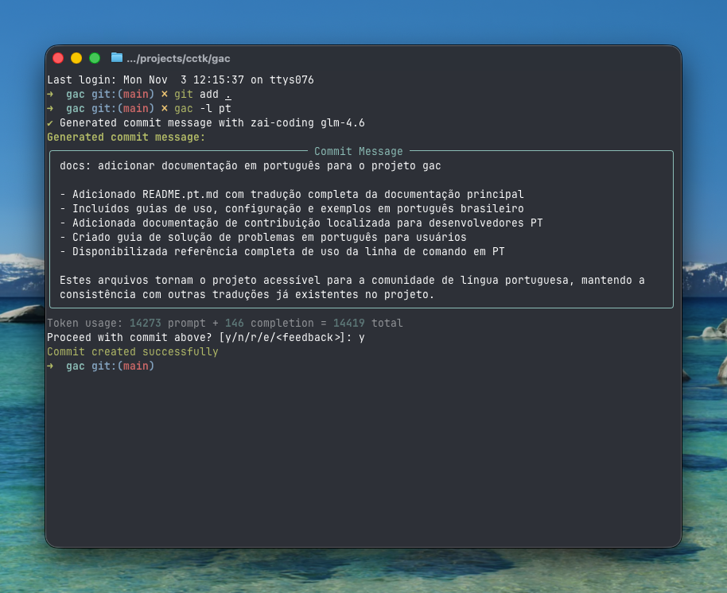

<!-- markdownlint-disable MD013 -->
<!-- markdownlint-disable MD033 MD036 -->

<div align="center">

# 🚀 Git Auto Commit (gac)

[](https://pypi.org/project/gac/)
[](https://www.python.org/downloads/)
[](https://github.com/cellwebb/gac/actions)
[](https://app.codecov.io/gh/cellwebb/gac)
[](https://github.com/astral-sh/ruff)
[](https://mypy-lang.org/)
[](docs/pt/CONTRIBUTING.md)
[](LICENSE)

[English](../../README.md) | [简体中文](../zh-CN/README.md) | [繁體中文](../zh-TW/README.md) | [日本語](../ja/README.md) | [한국어](../ko/README.md) | [हिन्दी](../hi/README.md) | [Français](../fr/README.md) | [Русский](../ru/README.md) | [Español](../es/README.md) | **Português** | [Deutsch](../de/README.md) | [Nederlands](../nl/README.md)

**Mensagens de commit alimentadas por LLM que entendem seu código!**

**Automatize seus commits!** Substitua `git commit -m "..."` por `gac` para mensagens de commit contextuais e bem formatadas geradas por modelos de linguagem grandes!

---

## O Que Você Obtém

Mensagens inteligentes e contextuais que explicam o **porquê** por trás de suas alterações:



---

</div>

<!-- markdownlint-enable MD033 MD036 -->

<!-- markdownlint-enable MD033 MD036 -->

## Início Rápido

### Use o gac sem instalar

```bash
uvx gac init   # Configure seu provedor, modelo e idioma
uvx gac model  # Execute novamente a configuração de provedor/modelo sem prompts de idioma
uvx gac  # Gere e envie commit com LLM
```

É isso! Revise a mensagem gerada e confirme com `y`.

### Instale e use o gac

```bash
uv tool install gac
gac init
gac model
gac
```

### Atualize o gac instalado

```bash
uv tool upgrade gac
```

---

## Recursos Principais

### 🌐 **Provedores Suportados**

- **Anthropic** • **Cerebras** • **Chutes.ai** • **DeepSeek** • **Fireworks**
- **Gemini** • **Groq** • **LM Studio** • **MiniMax** • **Mistral** • **Ollama** • **OpenAI**
- **OpenRouter** • **Streamlake** • **Synthetic.new** • **Together AI**
- **Z.AI** • **Z.AI Coding** • **Endpoints Personalizados (Anthropic/OpenAI)**

### 🧠 **Análise Inteligente de LLM**

- **Entende a intenção**: Analisa estrutura, lógica e padrões do código para entender o "porquê" por trás de suas alterações, não apenas o que mudou
- **Consciência semântica**: Reconhece refatoração, correções de bugs, funcionalidades e alterações quebrando para gerar mensagens contextualmente apropriadas
- **Filtragem inteligente**: Prioriza alterações significativas enquanto ignora arquivos gerados, dependências e artefatos
- **Agrupamento inteligente de commits** - Agrupa automaticamente alterações relacionadas em múltiplos commits lógicos com `--group`

### 📝 **Múltiplos Formatos de Mensagem**

- **Uma linha** (flag -o): Mensagem de commit de uma única linha seguindo formato de commit convencional
- **Padrão** (padrão): Resumo com pontos de bullet explicando detalhes da implementação
- **Verboso** (flag -v): Explicações abrangentes incluindo motivação, abordagem técnica e análise de impacto

### 🌍 **Suporte Multilíngue**

- **25+ idiomas**: Gere mensagens de commit em inglês, chinês, japonês, coreano, espanhol, francês, alemão e mais de 20 idiomas
- **Tradução flexível**: Escolha manter prefixos de commit convencionais em inglês para compatibilidade de ferramentas, ou traduza-os completamente
- **Múltiplos workflows**: Defina um idioma padrão com `gac language`, ou use a flag `-l <idioma>` para substituições únicas
- **Suporte a script nativo**: Suporte completo para scripts não-latinos incluindo CJK, cirílico, árabe e mais

### 💻 **Experiência do Desenvolvedor**

- **Feedback interativo**: Digite `r` para rerolar, `e` para editar no local com keybindings vi/emacs, ou digite diretamente seu feedback como `make it shorter` ou `focus on the bug fix`
- **Workflows de um comando**: Workflows completos com flags como `gac -ayp` (adicionar tudo, auto-confirmar, push)
- **Integração Git**: Respeita hooks pre-commit e lefthook, executando-os antes de operações LLM caras

### 🛡️ **Segurança Integrada**

- **Detecção automática de segredos**: Examina em busca de chaves API, senhas e tokens antes de commitar
- **Proteção interativa**: Solicita antes de cometer dados potencialmente sensíveis com claras opções de remediação
- **Filtragem inteligente**: Ignora arquivos de exemplo, arquivos de template e texto placeholder para reduzir falsos positivos

---

## Exemplos de Uso

### Workflow Básico

```bash
# Prepare suas alterações
git add .

# Gere e envie commit com LLM
gac

# Revise → y (commit) | n (cancelar) | r (rerolar) | e (editar) | ou digite feedback
```

### Comandos Comuns

| Comando         | Descrição                                                             |
| --------------- | --------------------------------------------------------------------- |
| `gac`           | Gerar mensagem de commit                                              |
| `gac -y`        | Auto-confirmar (sem necessidade de revisão)                           |
| `gac -a`        | Adicionar tudo antes de gerar mensagem de commit                      |
| `gac -o`        | Mensagem de uma linha para alterações triviais                        |
| `gac -v`        | Formato verboso com Motivação, Abordagem Técnica e Análise de Impacto |
| `gac -h "hint"` | Adicionar contexto para LLM (ex: `gac -h "bug fix"`)                  |
| `gac -s`        | Incluir escopo (ex: feat(auth):)                                      |
| `gac -p`        | Fazer commit e push                                                   |

### Exemplos para Usuários Avançados

```bash
# Workflow completo em um comando
gac -ayp -h "preparação de release"

# Explicação detalhada com escopo
gac -v -s

# Mensagem rápida de uma linha para pequenas alterações
gac -o

# Agrupe alterações em commits logicamente relacionados
gac -ag

# Debugue o que o LLM vê
gac --show-prompt

# Pule verificação de segurança (use com cuidado)
gac --skip-secret-scan
```

### Sistema de Feedback Interativo

Não satisfeito com o resultado? Você tem várias opções:

```bash
# Reroll simples (sem feedback)
r

# Edite no local com edição rica de terminal
e
# Usa prompt_toolkit para edição multi-linha com keybindings vi/emacs
# Pressione Esc+Enter ou Ctrl+S para enviar, Ctrl+C para cancelar

# Ou simplesmente digite seu feedback diretamente!
make it shorter and focus on the performance improvement
use conventional commit format with scope
explain the security implications

# Pressione Enter em entrada vazia para ver o prompt novamente
```

O recurso de edição (`e`) fornece edição rica no local no terminal, permitindo que você:

- **Edite naturalmente**: Edição multi-linha com keybindings familiares vi/emacs
- **Faça correções rápidas**: Corrija erros de digitação, ajuste wording ou refine formatação
- **Adicione detalhes**: Inclua informações que o LLM pode ter perdido
- **Reestruture**: Reorganize pontos de bullet ou mude a estrutura da mensagem

---

## Configuração

Execute `gac init` para configurar seu provedor interativamente, ou defina variáveis de ambiente:

Precisa mudar provedores ou modelos depois sem tocar nas configurações de idioma? Use `gac model` para um fluxo simplificado que pula os prompts de idioma.

```bash
# Exemplo de configuração
GAC_MODEL=anthropic:your-model-name
OPENAI_API_KEY=your_key_here
ANTHROPIC_API_KEY=your_key_here
```

Veja `.gac.env.example` para todas as opções disponíveis.

**Quer mensagens de commit em outro idioma?** Execute `gac language` para selecionar entre 25+ idiomas incluindo Español, Français, 日本語, e mais.

**Quer personalizar o estilo da mensagem de commit?** Veja [docs/CUSTOM_SYSTEM_PROMPTS.md](docs/pt/CUSTOM_SYSTEM_PROMPTS.md) para orientação sobre como escrever prompts de sistema personalizados.

---

## Análise do Projeto

📊 **[Ver análises de uso em tempo real e estatísticas →](https://clickpy.clickhouse.com/dashboard/gac)**

Acompanhe métricas de instalação em tempo real e estatísticas de download de pacotes.

---

## Obtendo Ajuda

- **Documentação completa**: [USAGE.md](docs/pt/USAGE.md) - Referência completa da CLI
- **Prompts personalizados**: [CUSTOM_SYSTEM_PROMPTS.md](docs/pt/CUSTOM_SYSTEM_PROMPTS.md) - Personalize o estilo da mensagem de commit
- **Solução de problemas**: [TROUBLESHOOTING.md](docs/pt/TROUBLESHOOTING.md) - Problemas comuns e soluções
- **Contribuindo**: [CONTRIBUTING.md](docs/pt/CONTRIBUTING.md) - Configuração de desenvolvimento e diretrizes

---

<!-- markdownlint-disable MD033 MD036 -->

<div align="center">

Feito com ❤️ para desenvolvedores que querem melhores mensagens de commit

[⭐ Nos dê uma estrela no GitHub](https://github.com/cellwebb/gac) • [🐛 Reporte problemas](https://github.com/cellwebb/gac/issues) • [📖 Documentação completa](docs/pt/USAGE.md)

</div>

<!-- markdownlint-enable MD033 MD036 -->
