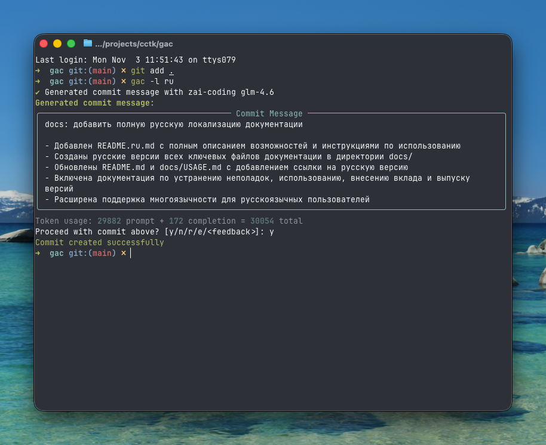

<!-- markdownlint-disable MD013 -->
<!-- markdownlint-disable MD033 MD036 -->

<div align="center">

# 🚀 Git Auto Commit (gac)

[](https://pypi.org/project/gac/)
[](https://www.python.org/downloads/)
[](https://github.com/cellwebb/gac/actions)
[](https://app.codecov.io/gh/cellwebb/gac)
[](https://github.com/astral-sh/ruff)
[](https://mypy-lang.org/)
[](docs/ru/CONTRIBUTING.md)
[](LICENSE)

[English](../../README.md) | [简体中文](../zh-CN/README.md) | [繁體中文](../zh-TW/README.md) | [日本語](../ja/README.md) | [한국어](../ko/README.md) | [हिन्दी](../hi/README.md) | [Tiếng Việt](../vi/README.md) | [Français](../fr/README.md) | **Русский** | [Español](../es/README.md) | [Português](../pt/README.md) | [Norsk](../no/README.md) | [Svenska](../sv/README.md) | [Deutsch](../de/README.md) | [Nederlands](../nl/README.md) | [Italiano](../it/README.md)

**Коммиты, созданные ИИ, которые понимают ваш код!**

**Автоматизируйте свои коммиты!** Замените `git commit -m "..."` на `gac` для получения контекстуальных, хорошо отформатированных сообщений коммитов, сгенерированных большими языковыми моделями!

---

## Что вы получаете

Интеллектуальные, контекстуальные сообщения, которые объясняют **почему** ваших изменений:



---

</div>

<!-- markdownlint-enable MD033 MD036 -->

## Быстрый старт

### Использование gac без установки

```bash
uvx gac init   # Настройте вашего провайдера, модель и язык
uvx gac model  # Повторно запустите настройку провайдера/модели без запросов языка
uvx gac  # Сгенерируйте и закоммитьте с помощью ИИ
```

Вот и всё! Проверьте сгенерированное сообщение и подтвердите с `y`.

### Установка и использование gac

```bash
uv tool install gac
gac init
gac model
gac
```

### Обновление установленного gac

```bash
uv tool upgrade gac
```

---

## Основные функции

### 🌐 **Поддерживаемые провайдеры**

- **Anthropic** • **Cerebras** • **Chutes.ai** • **DeepSeek** • **Fireworks**
- **Gemini** • **Groq** • **LM Studio** • **MiniMax** • **Mistral** • **Ollama** • **OpenAI**
- **OpenRouter** • **Streamlake** • **Synthetic.new** • **Together AI**
- **Z.AI** • **Z.AI Coding** • **Пользовательские эндпоинты (Anthropic/OpenAI)**

### 🧠 **Умный анализ ИИ**

- **Понимает намерение**: Анализирует структуру кода, логику и паттерны для понимания "почему" за вашими изменениями, а не только что изменилось
- **Семантическая осведомлённость**: Распознаёт рефакторинг, исправления ошибок, функции и критические изменения для генерации контекстуально подходящих сообщений
- **Умная фильтрация**: Приоритизирует значимые изменения, игнорируя сгенерированные файлы, зависимости и артефакты
- **Умная группировка коммитов** - Автоматически группирует связанные изменения в несколько логических коммитов с `--group`

### 📝 **Множественные форматы сообщений**

- **Однострочный** (-o): Сообщение коммита в одну строку в формате conventional commit
- **Стандартный** (по умолчанию): Резюме с маркерами, объясняющими детали реализации
- **Подробный** (-v): исчерпывающие объяснения, включая мотивацию, технический подход и анализ влияния

### 🌍 **Многоязычная поддержка**

- **25+ языков**: Генерируйте сообщения коммитов на английском, китайском, японском, корейском, испанском, французском, немецком и более 20 других языках
- **Гибкий перевод**: Выберите сохранять префиксы conventional commit на английском для совместимости инструментов или полностью их переведите
- **Множественные рабочие процессы**: Установите язык по умолчанию с `gac language` или используйте флаг `-l <language>` для разового изменения
- **Поддержка родных скриптов**: Полная поддержка не-латинских скриптов, включая CJK, кириллицу, арабский и другие

### 💻 **Опыт разработчика**

- **Интерактивная обратная связь**: Введите `r` для перегенерации, `e` для редактирования на месте с горячими клавишами vi/emacs или напрямую введите ваш отзыв, например, "сделай короче" или "сосредоточься на исправлении ошибки"
- **Рабочие процессы в одну команду**: Полные рабочие процессы с флагами, такими как `gac -ayp` (индексировать всё, автоподтверждение, отправить)
- **Интеграция с Git**: Уважает хуки pre-commit и lefthook, запуская их перед дорогостоящими операциями ИИ

### 🛡️ **Встроенная безопасность**

- **Автоматическое обнаружение секретов**: Сканирует наличие ключей API, паролей и токенов перед коммитом
- **Интерактивная защита**: Запрашивает подтверждение перед коммитом потенциально чувствительных данных с чёткими опциями исправления
- **Умная фильтрация**: Игнорирует примеры файлов, шаблоны и текст-заполнители для уменьшения ложных срабатываний

---

## Примеры использования

### Базовый рабочий процесс

```bash
# Индексируйте ваши изменения
git add .

# Сгенерируйте и закоммитьте с помощью ИИ
gac

# Проверьте → y (коммит) | n (отмена) | r (перегенерировать) | e (редактировать) | или введите отзыв
```

### Распространённые команды

| Команда              | Описание                                                               |
| -------------------- | ---------------------------------------------------------------------- |
| `gac`                | Сгенерировать сообщение коммита                                        |
| `gac -y`             | Автоподтверждение (проверка не требуется)                              |
| `gac -a`             | Индексировать всё перед генерацией сообщения коммита                   |
| `gac -o`             | Однострочное сообщение для незначительных изменений                    |
| `gac -v`             | Подробный формат с мотивацией, техническим подходом и анализом влияния |
| `gac -h "подсказка"` | Добавить контекст для ИИ (например, `gac -h "исправление ошибки"`)     |
| `gac -s`             | Включить область (например, feat(auth):)                               |
| `gac -p`             | Закоммитить и отправить                                                |

### Примеры для опытных пользователей

```bash
# Полный рабочий процесс в одной команде
gac -ayp -h "подготовка релиза"

# Подробное объяснение с областью
gac -v -s

# Быстрое однострочное сообщение для небольших изменений
gac -o

# Сгруппировать изменения в логически связанные коммиты
gac -ag

# Отладить то, что видит ИИ
gac --show-prompt

# Пропустить сканирование безопасности (используйте осторожно)
gac --skip-secret-scan
```

### Система интерактивной обратной связи

Не довольны результатом? У вас есть несколько опций:

```bash
# Простая перегенерация (без отзыва)
r

# Редактировать на месте с богатым редактированием в терминале
e
# Использует prompt_toolkit для многострочного редактирования с горячими клавишами vi/emacs
# Нажмите Esc+Enter или Ctrl+S для отправки, Ctrl+C для отмены

# Или просто введите ваш отзыв напрямую!
сделай короче и сосредоточься на улучшении производительности
используй формат conventional commit с областью
объясни последствия для безопасности

# Нажмите Enter на пустом вводе, чтобы увидеть приглашение снова
```

Функция редактирования (`e`) предоставляет богатое редактирование на месте в терминале, позволяя вам:

- **Редактировать естественно**: Многострочное редактирование с привычными горячими клавишами vi/emacs
- **Вносить быстрые исправления**: Исправлять опечатки, корректировать формулировки или улучшать форматирование
- **Добавлять детали**: Включать информацию, которую ИИ мог упустить
- **Реструктурировать**: Реорганизовывать маркеры или изменять структуру сообщения

---

## Конфигурация

Запустите `gac init` для интерактивной настройки вашего провайдера или установите переменные окружения:

Нужно изменить провайдеров или модели позже, не затрагивая настройки языка? Используйте `gac model` для упрощённого рабочего процесса, который пропускает запросы языка.

```bash
# Пример конфигурации
GAC_MODEL=anthropic:your-model-name
OPENAI_API_KEY=your_key_here
ANTHROPIC_API_KEY=your_key_here
```

Смотрите `.gac.env.example` для всех доступных опций.

**Хотите сообщения коммитов на другом языке?** Запустите `gac language` для выбора из 25+ языков, включая Español, Français, 日本語 и другие.

**Хотите настроить стиль сообщений коммитов?** См. [docs/CUSTOM_SYSTEM_PROMPTS.md](docs/ru/CUSTOM_SYSTEM_PROMPTS.md) для руководства по написанию пользовательских системных промптов.

---

## Аналитика проекта

📊 **[Просмотреть аналитику использования и статистику в реальном времени →](https://clickpy.clickhouse.com/dashboard/gac)**

Отслеживайте метрики установки в реальном времени и статистику загрузки пакетов.

---

## Получение помощи

- **Полная документация**: [USAGE.md](docs/ru/USAGE.md) - Полное справочное руководство по CLI
- **Пользовательские промпты**: [CUSTOM_SYSTEM_PROMPTS.md](docs/ru/CUSTOM_SYSTEM_PROMPTS.md) - Настройка стиля сообщений коммитов
- **Устранение неполадок**: [TROUBLESHOOTING.md](docs/ru/TROUBLESHOOTING.md) - Распространённые проблемы и решения
- **Вклад в проект**: [CONTRIBUTING.md](docs/ru/CONTRIBUTING.md) - Настройка среды разработки и руководства

---

<!-- markdownlint-disable MD033 MD036 -->

<div align="center">

Сделано с ❤️ для разработчиков, которые хотят лучшие сообщения коммитов

[⭐ Поставьте нам звезду на GitHub](https://github.com/cellwebb/gac) • [🐛 Сообщить о проблемах](https://github.com/cellwebb/gac/issues) • [📖 Полная документация](docs/ru/USAGE.md)

</div>

<!-- markdownlint-enable MD033 MD036 -->
