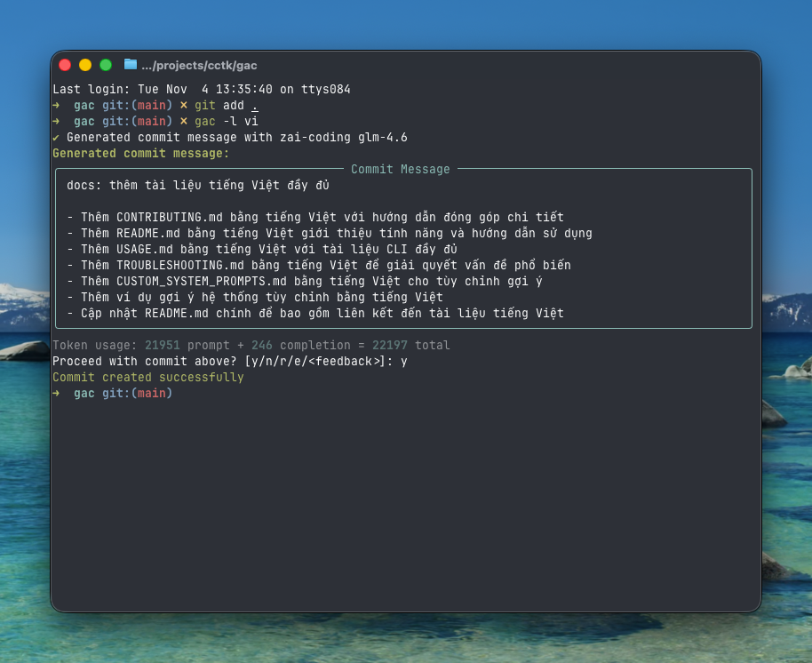

<!-- markdownlint-disable MD013 -->
<!-- markdownlint-disable MD033 MD036 -->

<div align="center">

# 🚀 Git Auto Commit (gac)

[](https://pypi.org/project/gac/)
[](https://www.python.org/downloads/)
[](https://github.com/cellwebb/gac/actions)
[](https://app.codecov.io/gh/cellwebb/gac)
[](https://github.com/astral-sh/ruff)
[](https://mypy-lang.org/)
[](CONTRIBUTING.md)
[](LICENSE)

[English](../../README.md) | [简体中文](../zh-CN/README.md) | [繁體中文](../zh-TW/README.md) | [日本語](../ja/README.md) | [한국어](../ko/README.md) | [हिन्दी](../hi/README.md) | **Tiếng Việt** | [Français](../fr/README.md) | [Русский](../ru/README.md) | [Español](../es/README.md) | [Português](../pt/README.md) | [Norsk](../no/README.md) | [Svenska](../sv/README.md) | [Deutsch](../de/README.md) | [Nederlands](../nl/README.md) | [Italiano](../it/README.md)

**Thông điệp commit được hỗ trợ bởi LLM, hiểu mã của bạn!**

**Tự động hóa commit của bạn!** Thay thế `git commit -m "..."` bằng `gac` để có thông điệp commit có ngữ cảnh, được định dạng tốt được tạo ra bởi các mô hình ngôn ngữ lớn!

---

## Bạn Nhận Được Gì

Thông điệp thông minh, có ngữ cảnh giải thích **tại sao** đằng sau những thay đổi của bạn:



---

</div>

<!-- markdownlint-enable MD033 MD036 -->

## Bắt Đầu Nhanh

### Sử dụng gac mà không cần cài đặt

```bash
uvx gac init   # Cấu hình nhà cung cấp, mô hình và ngôn ngữ của bạn
uvx gac  # Tạo và commit với LLM
```

Chỉ vậy thôi! Xem lại thông điệp đã tạo và xác nhận bằng `y`.

### Cài đặt và sử dụng gac

```bash
uv tool install gac
gac init
gac
```

### Nâng cấp gac đã cài đặt

```bash
uv tool upgrade gac
```

---

## Tính Năng Chính

### 🌐 **Nhà Cung Cấp Hỗ Trợ**

- **Anthropic** • **Cerebras** • **Chutes.ai** • **Claude Code**
- **DeepSeek** • **Fireworks** • **Gemini** • **Groq** • **LM Studio**
- **MiniMax** • **Mistral** • **Ollama** • **OpenAI** • **OpenRouter**
- **Replicate** • **Streamlake** • **Synthetic.new** • **Together AI**
- **Z.AI** • **Z.AI Coding** • **Custom Endpoints (Anthropic/OpenAI)**

### 🧠 **Phân Tích LLM Thông Minh**

- **Hiểu ý định**: Phân tích cấu trúc mã, logic và các mẫu để hiểu "tại sao" đằng sau những thay đổi của bạn, không chỉ những gì đã thay đổi
- **Nhận thức ngữ nghĩa**: Nhận biết tái cấu trúc, sửa lỗi, tính năng và các thay đổibreaking để tạo thông điệp commit có ngữ cảnh phù hợp
- **Lọc thông minh**: Ưu tiên các thay đổi có ý nghĩa trong khi bỏ qua các tệp được tạo, phụ thuộc và artifacts
- **Nhóm commit thông minh** - Tự động nhóm các thay đổi liên quan thành nhiều commit logic với `--group`

### 📝 **Nhiều Định Dạng Thông Điệp**

- **Một dòng** (-o flag): Thông điệp commit một dòng theo định dạng commit tiêu chuẩn
- **Tiêu chuẩn** (mặc định): Tóm tắt với các gạch đầu dòng giải thích chi tiết triển khai
- **Chi tiết** (-v flag): Giải thích toàn diện bao gồm động cơ, cách tiếp cận kỹ thuật và phân tích tác động

### 🌍 **Hỗ Trợ Đa Ngôn Ngữ**

- **25+ ngôn ngữ**: Tạo thông điệp commit bằng tiếng Anh, tiếng Trung, tiếng Nhật, tiếng Hàn, tiếng Tây Ban Nha, tiếng Pháp, tiếng Đức và 20+ ngôn ngữ khác
- **Dịch linh hoạt**: Chọn giữ tiền tố commit tiêu chuẩn bằng tiếng Anh để tương thích công cụ, hoặc dịch hoàn toàn chúng
- **Nhiều quy trình làm việc**: Đặt ngôn ngữ mặc định với `gac language`, hoặc sử dụng flag `-l <language>` để ghi đè một lần
- **Hỗ trợ chữ viết gốc**: Hỗ trợ đầy đủ cho các chữ viết không phải Latin bao gồm CJK, Cyrillic, Thai và nhiều hơn nữa

### 💻 **Trải Nghiệm Nhà Phát Triển**

- **Phản hồi tương tác**: Gõ `r` để reroll, `e` để chỉnh sửa tại chỗ với phím tắt vi/emacs, hoặc gõ trực tiếp phản hồi của bạn như `làm nó ngắn hơn` hoặc `tập trung vào sửa lỗi`
- **Quy trình làm việc một lệnh**: Quy trình làm việc hoàn chỉnh với các flag như `gac -ayp` (stage tất cả, tự động xác nhận, push)
- **Tích hợp Git**: Tôn các hook pre-commit và lefthook, chạy chúng trước các thao tác LLM tốn kém

### 🛡️ **Bảo Mật Tích Hợp**

- **Phát hiện bí mật tự động**: Quét các khóa API, mật khẩu và token trước khi commit
- **Bảo vệ tương tác**: Gợi ý trước khi commit dữ liệu nhạy cảm tiềm tàng với các tùy chọn khắc phục rõ ràng
- **Lọc thông minh**: Bỏ qua các tệp ví dụ, tệp mẫu và văn bản giữ chỗ để giảm các dương tính giả

---

## Ví Dụ Sử Dụng

### Quy Trình Cơ Bản

```bash
# Stage các thay đổi của bạn
git add .

# Tạo và commit với LLM
gac

# Xem lại → y (commit) | n (hủy) | r (reroll) | e (chỉnh sửa) | hoặc gõ phản hồi
```

### Lệnh Thông Dụng

| Lệnh             | Mô t�                                                                         |
| ---------------- | ----------------------------------------------------------------------------- |
| `gac`            | Tạo thông điệp commit                                                         |
| `gac -y`         | Tự động xác nhận (không cần xem lại)                                          |
| `gac -a`         | Stage tất cả trước khi tạo thông điệp commit                                  |
| `gac -o`         | Thông điệp một dòng cho các thay đổi nhỏ                                      |
| `gac -v`         | Định dạng chi tiết với Động cơ, Cách tiếp cận Kỹ thuật, và Phân tích Tác động |
| `gac -h "gợi ý"` | Thêm ngữ cảnh cho LLM (ví dụ, `gac -h "sửa lỗi"`)                             |
| `gac -s`         | Bao gồm phạm vi (ví dụ, feat(auth):)                                          |
| `gac -p`         | Commit và push                                                                |

### Ví Dụ Người Dùng Nâng Cao

```bash
# Quy trình hoàn chỉnh trong một lệnh
gac -ayp -h "chuẩn bị phát hành"

# Giải thích chi tiết với phạm vi
gac -v -s

# Thông điệp một dòng nhanh cho các thay đổi nhỏ
gac -o

# Nhóm các thay đổi thành các commit logic liên quan
gac -ag

# Gỡ lỗi xem LLM thấy gì
gac --show-prompt

# Bỏ qua quét bảo mật (sử dụng cẩn thận)
gac --skip-secret-scan
```

### Hệ Thống Phản Hồi Tương Tác

Không hài lòng với kết quả? Bạn có một số tùy chọn:

```bash
# Reroll đơn giản (không có phản hồi)
r

# Chỉnh sửa tại chỗ với chỉnh sửa terminal phong phú
e
# Sử dụng prompt_toolkit để chỉnh sửa đa dòng với phím tắt vi/emacs
# Nhấn Esc+Enter hoặc Ctrl+S để gửi, Ctrl+C để hủy

# Hoặc chỉ gõ phản hồi của bạn trực tiếp!
làm nó ngắn hơn và tập trung vào cải thiện hiệu suất
sử dụng định dạng commit tiêu chuẩn với phạm vi
giải thích các tác động bảo mật

# Nhấn Enter trên input trống để xem gợi ý lại
```

Tính năng chỉnh sửa (`e`) cung cấp chỉnh sửa terminal tại chỗ phong phú, cho phép bạn:

- **Chỉnh sửa tự nhiên**: Chỉnh sửa đa dòng với các phím tắt vi/emacs quen thuộc
- **Sửa lỗi nhanh**: Chỉnh sửa lỗi chính tả, điều chỉnh từ ngữ, hoặc tinh chỉnh định dạng
- **Thêm chi tiết**: Bao gồm thông tin mà LLM có thể đã bỏ lỡ
- **Cấu trúc lại**: Tổ chức lại các gạch đầu dòng hoặc thay đổi cấu trúc thông điệp

---

## Cấu Hình

Chạy `gac init` để cấu hình nhà cung cấp của bạn một cách tương tác, hoặc đặt các biến môi trường:

Cần thay đổi nhà cung cấp hoặc mô hình sau này mà không ảnh hưởng đến cài đặt ngôn ngữ? Sử dụng `gac model` cho quy trình hợp lý bỏ qua các gợi ý ngôn ngữ.

```bash
# Ví dụ cấu hình
GAC_MODEL=anthropic:your-model-name
OPENAI_API_KEY=your_key_here
ANTHROPIC_API_KEY=your_key_here
```

Xem `.gac.env.example` cho tất cả các tùy chọn có sẵn.

**Muốn thông điệp commit bằng ngôn ngữ khác?** Chạy `gac language` để chọn từ 25+ ngôn ngữ bao gồm Español, Français, 日本語 và nhiều hơn nữa.

**Muốn tùy chỉnh kiểu thông điệp commit?** Xem [docs/CUSTOM_SYSTEM_PROMPTS.md](CUSTOM_SYSTEM_PROMPTS.md) để được hướng dẫn viết các gợi ý hệ thống tùy chỉnh.

---

## Phân Tích Dự Án

📊 **[Xem phân tích sử dụng và thống kê trực tiếp →](https://clickpy.clickhouse.com/dashboard/gac)**

Theo dõi chỉ số cài đặt thời gian thực và thống kê tải xuống gói.

---

## Nhận Trợ Giúp

- **Tài liệu đầy đủ**: [USAGE.md](USAGE.md) - Tham chiếu CLI hoàn chỉnh
- **Gợi ý tùy chỉnh**: [CUSTOM_SYSTEM_PROMPTS.md](CUSTOM_SYSTEM_PROMPTS.md) - Tùy chỉnh kiểu thông điệp commit
- **Xử lý sự cố**: [TROUBLESHOOTING.md](TROUBLESHOOTING.md) - Các vấn đề phổ biến và giải pháp
- **Đóng góp**: [CONTRIBUTING.md](CONTRIBUTING.md) - Thiết lập phát triển và hướng dẫn

---

<!-- markdownlint-disable MD033 MD036 -->

<div align="center">

Được tạo với ❤️ cho các nhà phát triển muốn có thông điệp commit tốt hơn

[⭐ Star chúng tôi trên GitHub](https://github.com/cellwebb/gac) • [🐛 Báo cáo vấn đề](https://github.com/cellwebb/gac/issues) • [📖 Tài liệu đầy đủ](USAGE.md)

</div>

<!-- markdownlint-enable MD033 MD036 -->
