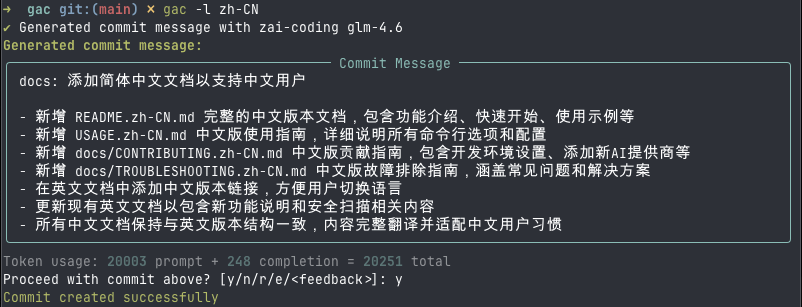

<!-- markdownlint-disable MD013 -->
<!-- markdownlint-disable MD033 MD036 -->

<div align="center">

# 🚀 Git Auto Commit (gac)

[](https://pypi.org/project/gac/)
[](https://www.python.org/downloads/)
[](https://github.com/cellwebb/gac/actions)
[](https://app.codecov.io/gh/cellwebb/gac)
[](https://github.com/astral-sh/ruff)
[](https://mypy-lang.org/)
[](docs/zh-CN/CONTRIBUTING.md)
[](LICENSE)

[English](../../README.md) | **简体中文** | [繁體中文](../zh-TW/README.md) | [日本語](../ja/README.md) | [한국어](../ko/README.md) | [हिन्दी](../hi/README.md) | [Tiếng Việt](../vi/README.md) | [Français](../fr/README.md) | [Русский](../ru/README.md) | [Español](../es/README.md) | [Português](../pt/README.md) | [Norsk](../no/README.md) | [Svenska](../sv/README.md) | [Deutsch](../de/README.md) | [Nederlands](../nl/README.md) | [Italiano](../it/README.md)

**能理解你代码的 LLM 驱动的提交信息！**

**自动化你的提交！**用 `gac` 替代 `git commit -m "..."`，生成由大型语言模型创建的上下文相关、格式良好的提交信息！

---

## 你将获得

智能的、上下文相关的信息，解释你更改背后的**原因**：



---

</div>

<!-- markdownlint-enable MD033 MD036 -->

## 快速开始

### 无需安装直接使用 gac

```bash
uvx gac init   # 配置提供商、模型和语言
uvx gac  # 使用 LLM 生成并提交
```

就是这么简单！查看生成的信息并用 `y` 确认。

### 安装并使用 gac

```bash
uv tool install gac
gac init
gac
```

### 升级已安装的 gac

```bash
uv tool upgrade gac
```

---

## 核心特性

### 🌐 **支持的提供商**

- **Anthropic** • **Cerebras** • **Chutes.ai** • **Claude Code OAuth**
- **DeepSeek** • **Fireworks** • **Gemini** • **Groq** • **Kimi for Coding**
- **LM Studio** • **MiniMax.io** • **Mistral AI** • **Moonshot AI** • **Ollama**
- **OpenAI** • **OpenRouter** • **Replicate** • **Streamlake** • **Synthetic.new**
- **Together AI** • **Z.AI** • **Z.AI Coding** • **Custom Endpoints (Anthropic/OpenAI)**

### 🧠 **智能 LLM 分析**

- **理解意图**：分析代码结构、逻辑和模式，理解你更改背后的"原因"，而不仅仅是改变了什么
- **语义感知**：识别重构、错误修复、新特性和破坏性更改，生成上下文适当的信息
- **智能过滤**：优先考虑有意义的更改，同时忽略生成的文件、依赖项和构件
- **智能提交分组** - 使用 `--group` 自动将相关更改分组为多个逻辑提交

### 📝 **多种信息格式**

- **单行**（-o 标志）：遵循常规提交格式的单行提交信息
- **标准**（默认）：带有解释实现细节的要点的摘要
- **详细**（-v 标志）：包括动机、技术方法和影响分析的全面解释

### 🌍 **多语言支持**

- **25+ 种语言**：生成英语、中文、日语、韩语、西班牙语、法语、德语等 20 多种语言的提交信息
- **灵活翻译**：选择保持常规提交前缀为英语以保持工具兼容性，或完全翻译它们
- **多种工作流**：使用 `gac language` 设置默认语言，或使用 `-l <语言>` 标志进行一次性覆盖
- **原生脚本支持**：完全支持非拉丁文字，包括中日韩、西里尔文、泰文等

### 💻 **开发者体验**

- **交互式反馈**：输入 `r` 重新生成，`e` 使用 vi/emacs 键绑定就地编辑，或直接输入你的反馈，如 `让它更短` 或 `专注于错误修复`
- **单命令工作流**：使用 `gac -ayp`（暂存所有、自动确认、推送）等标志完成完整工作流
- **Git 集成**：尊重 pre-commit 和 lefthook 钩子，在昂贵的 LLM 操作之前运行它们

### 🛡️ **内置安全**

- **自动密钥检测**：在提交前扫描 API 密钥、密码和令牌
- **交互式保护**：在提交潜在敏感数据之前提示，并提供清晰的补救选项
- **智能过滤**：忽略示例文件、模板文件和占位符文本以减少误报

---

## 使用示例

### 基本工作流

```bash
# 暂存你的更改
git add .

# 使用 LLM 生成并提交
gac

# 查看 → y（提交）| n（取消）| r（重新生成）| e（编辑）| 或输入反馈
```

### 常用命令

| 命令            | 描述                                           |
| --------------- | ---------------------------------------------- |
| `gac`           | 生成提交信息                                   |
| `gac -y`        | 自动确认（无需查看）                           |
| `gac -a`        | 在生成提交信息之前暂存所有内容                 |
| `gac -o`        | 用于琐碎更改的单行信息                         |
| `gac -v`        | 包含动机、技术方法和影响分析的详细格式         |
| `gac -h "提示"` | 为 LLM 添加上下文（例如，`gac -h "错误修复"`） |
| `gac -s`        | 包括范围（例如，feat(auth):）                  |
| `gac -p`        | 提交并推送                                     |

### 高级用户示例

```bash
# 一条命令完成完整工作流
gac -ayp -h "发布准备"

# 带范围的详细解释
gac -v -s

# 小更改的快速单行
gac -o

# 将更改分组为逻辑相关的提交
gac -ag

# 调试 LLM 看到的内容
gac --show-prompt

# 跳过安全扫描（谨慎使用）
gac --skip-secret-scan
```

### 交互式反馈系统

对结果不满意？你有几个选项：

```bash
# 简单重新生成（无反馈）
r

# 使用丰富的终端编辑就地编辑
e
# 使用 prompt_toolkit 进行多行编辑，支持 vi/emacs 键绑定
# 按 Esc+Enter 或 Ctrl+S 提交，Ctrl+C 取消

# 或者直接输入你的反馈！
让它更短并专注于性能改进
使用带范围的常规提交格式
解释安全影响

# 在空输入上按 Enter 再次查看提示
```

编辑功能（`e`）提供丰富的就地终端编辑，允许你：

- **自然编辑**：使用熟悉的 vi/emacs 键绑定进行多行编辑
- **快速修复**：纠正拼写错误、调整措辞或改进格式
- **添加细节**：包括 LLM 可能遗漏的信息
- **重组**：重新组织要点或更改信息结构

---

## 配置

运行 `gac init` 以交互方式配置你的提供商，或设置环境变量：

想要在之后仅更新提供商或模型且不修改语言？使用 `gac model`，它会跳过语言相关的提示。

```bash
# 示例配置
GAC_MODEL=anthropic:your-model-name
OPENAI_API_KEY=your_key_here
ANTHROPIC_API_KEY=your_key_here
```

查看 `.gac.env.example` 了解所有可用选项。

**想要其他语言的提交信息？**运行 `gac language` 从 25 多种语言中选择，包括 Español、Français、日本語 等。

**想要自定义提交信息风格？**请参阅 [docs/CUSTOM_SYSTEM_PROMPTS.md](docs/zh-CN/CUSTOM_SYSTEM_PROMPTS.md) 了解编写自定义系统提示的指导。

---

## 项目分析

📊 **[查看实时使用分析和统计数据 →](https://clickpy.clickhouse.com/dashboard/gac)**

跟踪实时安装指标和包下载统计数据。

---

## 获取帮助

- **完整文档**：[USAGE.md](docs/zh-CN/USAGE.md) - 完整的 CLI 参考
- **自定义提示**：[CUSTOM_SYSTEM_PROMPTS.md](docs/zh-CN/CUSTOM_SYSTEM_PROMPTS.md) - 自定义提交信息风格
- **故障排除**：[TROUBLESHOOTING.md](docs/zh-CN/TROUBLESHOOTING.md) - 常见问题和解决方案
- **贡献**：[CONTRIBUTING.md](docs/zh-CN/CONTRIBUTING.md) - 开发设置和指南

---

<!-- markdownlint-disable MD033 MD036 -->

<div align="center">

用 ❤️ 为想要更好提交信息的开发者制作

[⭐ 在 GitHub 上给我们点星](https://github.com/cellwebb/gac) • [🐛 报告问题](https://github.com/cellwebb/gac/issues) • [📖 完整文档](docs/zh-CN/USAGE.md)

</div>

<!-- markdownlint-enable MD033 MD036 -->
