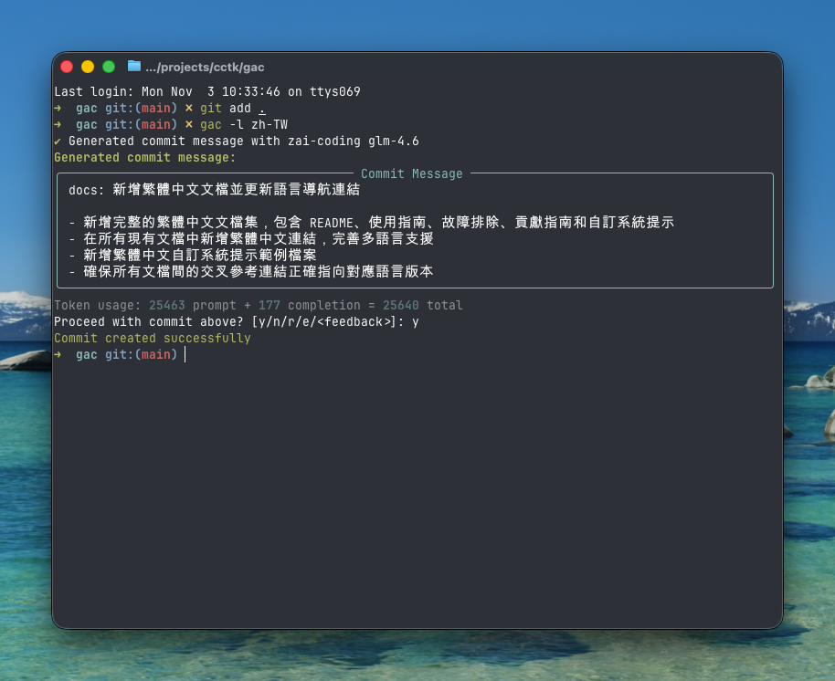

<!-- markdownlint-disable MD013 -->
<!-- markdownlint-disable MD033 MD036 -->

<div align="center">

# 🚀 Git Auto Commit (gac)

[](https://pypi.org/project/gac/)
[](https://www.python.org/downloads/)
[](https://github.com/cellwebb/gac/actions)
[](https://app.codecov.io/gh/cellwebb/gac)
[](https://github.com/astral-sh/ruff)
[](https://mypy-lang.org/)
[](docs/zh-TW/CONTRIBUTING.md)
[](LICENSE)

[English](../../README.md) | [简体中文](../zh-CN/README.md) | **繁體中文** | [日本語](../ja/README.md) | [한국어](../ko/README.md) | [हिन्दी](../hi/README.md) | [Tiếng Việt](../vi/README.md) | [Français](../fr/README.md) | [Русский](../ru/README.md) | [Español](../es/README.md) | [Português](../pt/README.md) | [Norsk](../no/README.md) | [Svenska](../sv/README.md) | [Deutsch](../de/README.md) | [Nederlands](../nl/README.md) | [Italiano](../it/README.md)

**能理解你程式碼的 LLM 驅動的提交訊息！**

**自動化你的提交！**用 `gac` 替代 `git commit -m "..."`，生成由大型語言模型建立的上下文相關、格式良好的提交訊息！

---

## 你將獲得

智慧的、上下文相關的訊息，解釋你變更背後的**原因**：



---

</div>

<!-- markdownlint-enable MD033 MD036 -->

## 快速開始

### 無需安裝直接使用 gac

```bash
uvx gac init   # 設定提供者、模型和語言
uvx gac  # 使用 LLM 生成並提交
```

就是這麼簡單！檢視生成的訊息並用 `y` 確認。

### 安裝並使用 gac

```bash
uv tool install gac
gac init
gac
```

### 升級已安裝的 gac

```bash
uv tool upgrade gac
```

---

## 核心特性

### 🌐 **支援的 25+ 提供者**

- **Anthropic** • **Azure OpenAI** • **Cerebras** • **Chutes.ai** • **Claude Code (OAuth)**
- **DeepSeek** • **Fireworks** • **Gemini** • **Groq** • **Kimi for Coding** • **LM Studio**
- **MiniMax.io** • **Mistral AI** • **Moonshot AI** • **Ollama** • **OpenAI** • **OpenRouter**
- **Replicate** • **Streamlake** • **Synthetic.new** • **Together AI** • **Z.AI** • **Z.AI Coding**
- **Custom Endpoints (Anthropic/OpenAI)**

### 🧠 **智慧 LLM 分析**

- **理解意圖**：分析程式碼結構、邏輯和模式，理解你變更背後的「原因」，而不僅僅是改變了什麼
- **語義感知**：識別重構、錯誤修復、新特性和破壞性變更，生成上下文適當的訊息
- **智慧過濾**：優先考慮有意義的變更，同時忽略產生的檔案、依賴項目和構件
- **智慧提交分組** - 使用 `--group` 自動將相關變更分組為多個邏輯提交

### 📝 **多種訊息格式**

- **單行**（-o 標誌）：遵循常規提交格式的單行提交訊息
- **標準**（預設）：帶有解釋實作細節的要點的摘要
- **詳細**（-v 標誌）：包括動機、技術方法和影響分析的全面解釋

### 🌍 **多語言支援**

- **25+ 種語言**：生成英語、中文、日語、韓語、西班牙語、法語、德語等 20 多種語言的提交訊息
- **彈性翻譯**：選擇保持常規提交前綴為英語以保持工具相容性，或完全翻譯它們
- **多種工作流程**：使用 `gac language` 設定預設語言，或使用 `-l <語言>` 標誌進行一次性覆蓋
- **原生文字支援**：完全支援非拉丁文字，包括中日韓、西里爾文、泰文等

### 💻 **開發者體驗**

- **互動式回饋**：輸入 `r` 重新生成，`e` 使用 vi/emacs 鍵繫結就地編輯，或直接輸入你的回饋，如 `讓它更短` 或 `專注於錯誤修復`
- **單命令工作流程**：使用 `gac -ayp`（暫存所有、自動確認、推送）等標誌完成完整工作流程
- **Git 整合**：尊重 pre-commit 和 lefthook 鉤子，在昂貴的 LLM 操作之前執行它們

### 🛡️ **內建安全**

- **自動密鑰檢測**：在提交前掃描 API 密鑰、密碼和權杖
- **互動式保護**：在提交潛在敏感資料之前提示，並提供清晰的補救選項
- **智慧過濾**：忽略範例檔案、範本檔案和佔位符文字以減少誤報

---

## 使用範例

### 基本工作流程

```bash
# 暫存你的變更
git add .

# 使用 LLM 生成並提交
gac

# 檢視 → y（提交）| n（取消）| r（重新生成）| e（編輯）| 或輸入回饋
```

### 常用命令

| 命令            | 描述                                           |
| --------------- | ---------------------------------------------- |
| `gac`           | 生成提交訊息                                   |
| `gac -y`        | 自動確認（無需檢視）                           |
| `gac -a`        | 在生成提交訊息之前暫存所有內容                 |
| `gac -o`        | 用於瑣碎變更的單行訊息                         |
| `gac -v`        | 包含動機、技術方法和影響分析的詳細格式         |
| `gac -h "提示"` | 為 LLM 新增上下文（例如，`gac -h "錯誤修復"`） |
| `gac -s`        | 包括範圍（例如，feat(auth):）                  |
| `gac -p`        | 提交並推送                                     |

### 進階使用者範例

```bash
# 一條命令完成完整工作流程
gac -ayp -h "發布準備"

# 帶範圍的詳細解釋
gac -v -s

# 小變更的快速單行
gac -o

# 將變更分組為邏輯相關的提交
gac -ag

# 偵錯 LLM 看到的內容
gac --show-prompt

# 跳過安全掃描（謹慎使用）
gac --skip-secret-scan
```

### 互動式回饋系統

對結果不滿意？你有幾個選項：

```bash
# 簡單重新生成（無回饋）
r

# 使用豐富的終端機編輯就地編輯
e
# 使用 prompt_toolkit 進行多行編輯，支援 vi/emacs 鍵繫結
# 按 Esc+Enter 或 Ctrl+S 提交，Ctrl+C 取消

# 或者直接輸入你的回饋！
讓它更短並專注於效能改進
使用帶範圍的常規提交格式
解釋安全影響

# 在空輸入上按 Enter 再次檢視提示
```

編輯功能（`e`）提供豐富的就地終端機編輯，允許你：

- **自然編輯**：使用熟悉的 vi/emacs 鍵繫結進行多行編輯
- **快速修復**：糾正拼寫錯誤、調整措辭或改進格式
- **新增細節**：包括 LLM 可能遺漏的資訊
- **重組**：重新組織要點或變更訊息結構

---

## 設定

執行 `gac init` 以互動方式設定你的提供者，或設定環境變數：

想要在之後僅更新提供者或模型且不修改語言？使用 `gac model`，它會跳過語言相關的提示。

```bash
# 範例設定
GAC_MODEL=anthropic:your-model-name
OPENAI_API_KEY=your_key_here
ANTHROPIC_API_KEY=your_key_here
```

檢視 `.gac.env.example` 了解所有可用選項。

**想要其他語言的提交訊息？**執行 `gac language` 從 25 多種語言中選擇，包括 Español、Français、日本語 等。

**想要自訂提交訊息風格？**請參閱 [docs/CUSTOM_SYSTEM_PROMPTS.md](docs/zh-TW/CUSTOM_SYSTEM_PROMPTS.md) 了解編寫自訂系統提示的指導。

---

## 專案分析

📊 **[檢視即時使用分析和統計資料 →](https://clickpy.clickhouse.com/dashboard/gac)**

追蹤即時安裝指標和套件下載統計資料。

---

## 獲取協助

- **完整文件**：[USAGE.md](docs/zh-TW/USAGE.md) - 完整的 CLI 參考
- **自訂提示**：[CUSTOM_SYSTEM_PROMPTS.md](docs/zh-TW/CUSTOM_SYSTEM_PROMPTS.md) - 自訂提交訊息風格
- **故障排除**：[TROUBLESHOOTING.md](docs/zh-TW/TROUBLESHOOTING.md) - 常見問題和解決方案
- **貢獻**：[CONTRIBUTING.md](docs/zh-TW/CONTRIBUTING.md) - 開發設定和指南

---

<!-- markdownlint-disable MD033 MD036 -->

<div align="center">

用 ❤️ 為想要更好提交訊息的開發者製作

[⭐ 在 GitHub 上給我們點星](https://github.com/cellwebb/gac) • [🐛 報告問題](https://github.com/cellwebb/gac/issues) • [📖 完整文件](docs/zh-TW/USAGE.md)

</div>

<!-- markdownlint-enable MD033 MD036 -->
